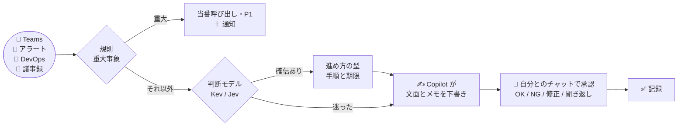

<p align="center">
  
</p>

<h1 align="center">kimeru</h1>

<p align="center">
  <b>PM の「どうする？」を、先回りして決める。</b><br>
  Teams・監視アラート・Azure DevOps・議事録が届くたびに、判断モデルが 1 問ずつ答え、<br>
  確信があれば決め、迷えばあなたに聞く。返信や起票の文面は Copilot が下書きし、承認はあなたの iPhone から。
</p>

<p align="center">
  
  
  
  
  
  
  
  
</p>

<p align="center">
  <a href="#-開発状況">開発状況</a> ·
  <a href="#-これは何をするツールか">概要</a> ·
  <a href="#-手に入るもの">手に入るもの</a> ·
  <a href="#-3コマンドで試す">3コマンドで試す</a> ·
  <a href="#-pm-の-1-日">PM の 1 日</a> ·
  <a href="#-文面の下書き">文面の下書き</a> ·
  <a href="#-会社-pc-で使う">会社 PC で使う</a> ·
  <a href="#-精度と限界">精度と限界</a> ·
  <a href="#-データの扱い">データの扱い</a>
</p>

---

## 🚦 開発状況

**v1.0 の公開準備が整った段階です（2026-09-29 時点）。** 会社 PC の実機で、判断から承認・通知までの主な流れを確かめました。
ただし、判断の精度は作者が作った **架空のイベント** での評価で、実際の業務データでの精度はこれからです。まず試すなら、下の「使える」だけで足ります。

| 状態 | 内容 |
|---|---|
| ✅ **使える**（会社 PC の実機で確認済み） | ・Teams・ADO・アラート・議事録の取り込みと、Kev による判断<br>・承認した ADO コメントの実行（設定したときだけ。**試験用の作業項目での実機確認はこれから**: `T22`）／件数だけの push 通知（`T21`）／Teams の全文読み取り（`T23` `T24`）。上の「改善」の表を参照<br>・GitHub Copilot CLI による文面とメモの下書き<br>・承認の流れ: 自分とのチャットへ投稿 → iPhone から `OK N` / `NG N` / `保留 N` / `聞き返し N` → 記録<br>・PC への Windows 通知<br>・**M365 だけの人向けの手動貼り付け**: `[kimeru #N Copilot 用]` の依頼文を Copilot に貼り、返ってきた文面を `下書き N <文面>` と返信すると取り込まれる<br>・外部への書き込みは **記録のみ**（実際に送るのは自分とのチャットへの投稿だけ） |
| 🧪 **実験的**（動くが、画面の作りに依存） | ・`m365-auto`: Teams 内の Microsoft 365 Copilot を画面操作して、文面とメモを自動で書かせる。会社 PC で、貼り付け・送信・返事の読み取り（1 回で 2 件の文面）まで通った。出典（参照したメール・会議）は、Copilot が挙げたときだけ表示<br>・失敗すると 30 分休み、その間は手動の依頼文に切り替わる。貼り付け先は多重に確認し、疑わしければ何も貼らずに止まる |
| ⚠ **環境しだい** | ・GitHub Copilot CLI（`KIMERU_WRITER=copilot`）: `copilot` コマンドがある環境で動く（会社 PC で 6 件の文面とメモを約 21 秒で下書き）。無い環境では `winget install GitHub.Copilot` が要る<br>・5 分ごとの自動運転（`schedule install`）: 試験用。writer の設定の引き継ぎは未確認 |
| ⏳ **これから** | ・実データ（匿名化した業務のイベント）での評価<br>・iPhone への通知（自分宛ての Teams 投稿は通知されない）<br>・実行器の解放（ADO コメントなど。今は記録のみ）<br>・確認待ちへの回答から、しきい値を自分のデータで調整 |

### 🆕 できないことを直した改善（v1.0 のあと・未リリース）

実機の結果から見えた「できないこと」を、機能で直しました。いずれも **既定は従来どおり**（有効にするのは設定したときだけ）。実機の確認が済んでいないものは、確認の名前（`T21`〜`T24`）を付けています。

| 改善 | できるようになること | 有効にする | 詳細 |
|---|---|---|---|
| ⚙ **設定ファイル** | 環境変数に頼らず `config.json` で設定。自動運転にも引き継がれる（引数 > 環境変数 > ファイル > 既定値。秘密は環境変数だけ） | `kimeru config set <項目> <値>` | [設定ファイル](#設定ファイル) |
| 📱 **iPhone への通知の代わり** | 件数だけを、Teams 以外の経路（push）へ送る。本文は送らない | 設定 `push`（`T21`） | [docs/push-notification.md](docs/push-notification.md) |
| ▶ **承認した ADO コメントの実行** | `OK N` のあと、Azure DevOps へコメントを実際に書く。二重実行を防ぎ、失敗は `再実行 N` で再試行 | 設定 `execute`（`T22`） | [docs/execute-ado-comment.md](docs/execute-ado-comment.md) |
| 📖 **Teams の本文を全文で読む** | 長い依頼の途中切れと前後のやり取りを、必要な件だけチャットを開いて読む | 設定 `read_full=1`（`T23` `T24`） | [下記](#teams-の本文を全文で読む) |
| ⚡ **判断の速さ** | 判断の順番・時間の上限・不要な質問の省略・質問の一括化。秒数は記録して比べられる | 設定 `priority` `plan_lean` `batch_questions` | [判断の速さ](#判断の速さ) |
| 🎚 **しきい値を自分のデータで調整** | `kimeru review` で正誤を付け、`calibrate` で係数の調整案を作る（適用・元に戻すも可） | `kimeru calibrate --apply` | [docs/trial-week.md](docs/trial-week.md) |
| 📋 **試験運用と報告** | 1 週間の試し方、週の集計（`digest --week --share`）、Issue の様式 | — | [docs/trial-week.md](docs/trial-week.md) |

**これまでの主なできごと**
- 2026-09-29: `m365-auto` が、依頼文を Copilot ではなく **別の会議チャットへ 2 回送信** する事故がありました。ウィンドウの題名は Copilot のままで、入力欄の特定が甘かったのが原因です。
  今は、入力欄自身の名前・フォーカス・貼った内容の一致を確かめてから貼り付けます。詳細と対策は [SECURITY.md](SECURITY.md) と [既知の課題](#既知の課題) にあります。

**確認結果（会社 PC、2026-09-29）**: `run-company-check.cmd V1`（承認・通知・GitHub Copilot・Copilot への貼り付け・`聞き返し N` / `下書き N`）はすべて OK、`T18`（`m365-auto`）は貼り付けから返事の読み取りまで OK でした。
手順は [docs/company-pc-test.md](docs/company-pc-test.md)。変更履歴は [CHANGELOG.md](CHANGELOG.md)、自動テストは Windows / Linux の CI で毎回走ります。

---

## 🧭 これは何をするツールか

PM の 1 日は、小さな判断の連続です。

- このチャットは **判断の依頼** か、ただの共有か
- このアラートは **今すぐ人を呼ぶ** べきか、来週でいいか
- このチケットは **着手できる状態** か、情報が足りないか
- 議事録のこの行は **決定・タスク・リスク** のどれか

kimeru は、この判断を **グラフ（JSON のデータ）** として書き出し、判断モデルに 1 問ずつ答えさせます。
確信があれば決めて次の一手まで用意し、迷ったものだけ自分とのチャットに届けます。
文面の下書きと、判断に役立つメモは、Copilot（任意）が付けます。



> 判断モデルは **型付きの質問に確率で答えるだけ** で、文章は書きません。重大事象は規則が先に決め、モデルの評価が低くても人を呼びます。Copilot を設定しなければ、文面は決まった定型文になります。

---

## ✅ 手に入るもの

以下は **架空のイベントを実際の kimeru に通した出力** です。数値・人名は説明用です。

**1. 判断依頼のチャットに、次の一手まで用意する**

```text
[08:30] QA リーダーから 1 対 1 チャット
    「リリース日を来週火曜にずらしてよいか判断お願いします。QA 環境が止まっていて至急です」
      [判断] intent: decision（確信度 0.85）
      [進め方] 型=スケジュール変更
        1. 遅延原因の復旧見込みを担当者に確認（今日）
        2. 現行日程に依存するチーム・顧客を確認（今日）
        3. 選択肢（延期・スコープ縮小・現状維持）を比較（今日）
        4. 日程を決定し記録（今日）
        5. 関係者へ変更を通知（今日）
```

**2. 重大障害は、モデルに聞く前に規則で決め、必ず知らせる**

```text
[09:10] 監視アラート（決済 API: 5xx error rate 23% for 10 minutes; customers cannot complete checkout）
      [規則] critical_outage: 該当 → モデルに聞かずに決定
    → 当番を呼び出し（予定） / 障害対応の手順 5 件を起票（予定）

[kimeru 通知] 自動で決定しました（alert-triage）      ← 自分とのチャットに投稿。返信は不要
```

**3. Copilot が文面と「判断材料」を用意して、承認を待つ**

```text
[kimeru #1] 判断が必要（teams-chat-triage）
元: 佐藤（QA）: リリース日を来週火曜にずらしてよいか判断お願いします。QA 環境が止まっていて至急です
Copilot のメモ:
・要点: QA環境の障害によるリリース日程の変更判断が求められています。
・足りない情報: QA環境の障害の詳細と復旧見込み時期 / 現在のリリース予定日 / 影響を受けるステークホルダー
・選択肢: リリース延期：QA完了を待つ（品質は確保、遅延のリスク） / スコープ縮小：機能を削って予定通り / 現状維持：予定通り（QA が不十分なリスク）
・次の一手: QA環境の障害の詳細と復旧見込みを佐藤さんに確認してください。
返信の下書き（copilot）:
受領しました。まず遅延原因の復旧見込みを確認させていただきます。
聞き返すなら（「聞き返し 1」でこちらを送る）:
QA環境の障害の詳細、復旧予定時刻、現在のリリース予定日を教えていただけますか。
作業項目の説明「遅延原因の復旧見込みを担当者に確認」の下書き（copilot）: …
作業項目の説明の下書き ほか 3 件（OK ですべて記録）
返信: OK 1 / NG 1 / 保留 1 / 修正 1 <直してほしい点> / 聞き返し 1
```

iPhone の Teams から `OK 1` と返すだけ。`修正 1 もっと短く` と返すと、書き直して同じ #1 で出し直します。

**4. 翌朝、今日やることの上位 3 件と、3 行の要点**

```text
[kimeru brief] 今日の進め方
今日の要点（Copilot）:
・最優先は障害対応の取りまとめです。社内外への一次連絡と対応責任者の指名が本日中に必要です。
・スケジュール変更の判断についても、遅延原因の復旧見込みを本日中に担当者に確認してください。
1. 確認待ち #1: 障害対応の取りまとめ: …
```

| これはやる | これはやらない |
| --- | --- |
| 届いたイベントを判断し、決めるか聞くかを選ぶ | あなたの代わりに勝手に返信・起票する（**外部への書き込みは今は記録のみ**） |
| 重大事象（障害・全ユーザー影響）を規則で先に拾い、必ず知らせる | 重大事象の判定をモデルだけに任せる |
| 判断の経路と確信度をすべて記録する | 理由の分からない「おすすめ」を出す |
| 迷ったら `unsure` として人に回す | 確信が低いのに断定する |
| （任意）文面の下書きと判断メモを Copilot に作らせ、人が確認する | LLM に判断そのものをさせる |

---

## 🚀 3コマンドで試す

**前提** — Python 3.10 以上（依存パッケージなし）。判断モデルなしのオフラインで動きます。

```bash
git clone https://github.com/awano27/pm-decision.git && cd pm-decision
python -m kimeru demo                          # PM の 1 日（9 イベント）を再生して out/report.html を作る
python -m kimeru run examples/teams_chat.json  # 1 件だけ判断させる
```

```text
=== まとめ
    判断 9 件: 自動で決定 8 / 確信が低く安全側で決定 0 / 人の確認 1
    うち規則（安全網）で即決定 3 件
```

> オフライン実行はキーワードによる簡易判定です。本物の判断は、ローカルの **Kev** か TypeSafe の **Jev** を使います（[下記](#-判断モデル)）。

---

## 📅 PM の 1 日

**朝にまとめを見る → 日中は届いたものを iPhone で承認 → 会議の後は議事録を置くだけ。**

| いつ | kimeru がすること | あなたがすること |
| --- | --- | --- |
| 朝 8 時 | 今日の要点と、やることの上位 3 件を自分とのチャットへ | 読む |
| チャットが来たとき | 判断依頼か・急ぎかを判断し、進め方・返信の下書き・判断メモを用意 | 迷ったものだけ `OK N` / `NG N` / `修正 N …` / `聞き返し N` |
| アラートが鳴ったとき | 重大なら当番呼び出しを記録し **[kimeru 通知]**、将来のリスクなら予防タスク | 迷ったものだけ確認 |
| チケットが起票されたとき | 重大バグは P1（通知）、情報不足なら確認コメント案、それ以外は優先度 | 迷ったものだけ確認 |
| 会議の後 | 議事録の 1 行ずつを決定・タスク・リスクに仕分け | Copilot の要約を `.txt` で置く（[形式](docs/minutes-format.md)） |

```powershell
python -m kimeru --backend kev daily --once --send   # 1 サイクル: 取り込み → 判断 → 下書き → 確認待ちを投稿 → 返信を反映 → 朝のまとめ
python -m kimeru --backend kev daily --send          # --once なしなら、300 秒ごとに繰り返す（--interval で変更）
```

- Teams は **画面のチャット一覧** から読みます（UI Automation。API・アプリ登録・管理者同意なし）
- ADO とアラートは本人の `az login` で取得します（ADO の組織が別のテナントにあっても、組織の URL から自動で判別します）
- 判断モデルが止まっている間のイベントは受信箱に残り、復帰後に判断されます（同じイベントを二重に判断しません）
- **自分とのチャットへの投稿は、自分の iPhone や PC には通知されません。** そこで、確認待ちや通知を投稿したら **PC に Windows の通知** を出します（クリックで自分とのチャットが開く。`KIMERU_TOAST=0` で無効）。iPhone には、Teams の Workflows などで **件数だけ** を届ける経路を選べます（[docs/push-notification.md](docs/push-notification.md)）
- 確認待ちも新しい投稿も無いサイクルは、自分とのチャットへの切り替えや書き込みをしません（チャット一覧は読みます）。**既定はこのままです。** 設定 `read_full=1` にしたときだけ、必要な件に限って、他のチャットを開いて全文を読みます（下記「Teams の本文を全文で読む」。開いたチャットは、Teams で既読になります）

### 別のパターン

- [新機能の要件を検討してほしいと頼まれたとき](docs/scenarios/requirements-review.md): 目的・対象ユーザーを聞く返信、選択肢の利点・懸念、6 ステップの進め方まで整える（実際の出力つき）

### 承認の返信

| 返信 | 動き |
|---|---|
| `OK N` | 下書きのまま承認し、行動を **記録**（相手への送信・起票はしません） |
| `NG N` | 却下。何も記録しません |
| `保留 N` | 後で決める。次のまとめにも残ります |
| `修正 N <指示>` | 指示に沿って書き直し、同じ #N で出し直します |
| `聞き返し N` | 「聞き返しの返信」を返信の下書きにして、同じ #N で出し直します。`OK N` で記録 |

<details>
<summary><b>同梱の判断グラフ（4 種類）と進め方の型（8 種類）</b></summary>

| 入力 | グラフ | 判断ポイント | 行き先 |
|---|---|---|---|
| 💬 Teams チャット | `teams_chat.json` | 意図 → 進め方 / 判断期限 | 受領返信・手順ごとの Task・Bug 化・人の確認 |
| 🚨 監視アラート | `monitor_alert.json` | 解消済み → **重大障害（規則）** → 将来のリスクか → 時期 / 顧客影響（**Sev0/1 ガード**）→ ノイズか | 当番呼び出し・予防 Task・P1 Bug・閾値見直し |
| 🎫 ADO チケット | `ado_workitem.json` | **重大バグ（規則）** → 受け入れ条件・再現手順（規則）→ 着手可能か → 優先度 | P1 固定・情報不足コメント・優先度設定・人のトリアージ |
| 📝 議事録 | `meeting_item.json` | ラベル（`決定:` `タスク:` `リスク:` `共有:`）は規則、なければ行の種類 → 担当 → 期限 | 決定ログ・Task・Risk 登録と対策手順 |

進め方の型（`playbooks/`）: スケジュール変更 / 障害対応 / スコープ変更 / 人員調整 / リリース判定 / ステークホルダー対応 / リスク対応 / 要件明確化。

グラフも型も JSON なので、**自分のチームの判断ポイントを足せます**。閉路・到達不能ノード・ルート漏れ・不正なしきい値は `python -m kimeru validate` が弾きます。

</details>

---

## 🧠 判断モデル

| | Kev（ローカル） | Jev（TypeSafe） |
|---|---|---|
| どこで動く | **この PC の CPU**（データは外に出ない） | クラウド API |
| 準備 | 持ち込み用フォルダ 1 つ | `TYPESAFE_API_KEY` |
| メモリ | bf16 で約 10GB。CPU が bf16 に対応していなければ、起動時に自動で fp32（約 14GB）を選ぶ | — |
| 使い方 | `--backend kev` | `--backend jev` |

```bash
# Kev を自分で立てる場合（別フォルダ。初回に重みを取得）
uv run --extra serve python -m kev.serve --run jaredpalmer/kev-4b --port 8009
python -m kimeru --backend kev run examples/teams_chat.json
```

[Kev](https://github.com/jaredpalmer/kev) は Jev と同じ API のローカルモデルです（Apache-2.0）。ローカル宛ての通信は、プロキシがあっても経由しません。

---

## 📨 文面の下書き

何をするかは判断モデル（Kev / Jev）が決め、その後の **文面と判断メモ** を文章生成 LLM（writer）に書かせます。設定しなければ、文面は定型文です。

| `KIMERU_WRITER` | 誰が書く | 本文の送り先 | 手間 |
|---|---|---|---|
| `copilot` | GitHub Copilot CLI（本人のサインイン。会社契約） | GitHub Copilot | 自動（1 件 10〜20 秒） |
| `m365` | あなたが Microsoft 365 Copilot に貼る | 会社の M365（手で貼る） | **M365 だけの人はこちら（推奨）**。承認の投稿の後に **「Copilot 用」の依頼文** が別投稿で届く。返ってきた文面は `下書き N <文面>` と 1 行で返信すると取り込まれる（[下記](#m365-だけの人向けの手順)） |
| `m365-auto`（**実験的**） | Teams 内の Copilot チャットを画面操作 | 会社の M365 | 自動（画面の作りに依存し、環境ごとの確認が要る）。失敗したら `m365` の依頼文に切り替わり、30 分は自動を休む。貼り付け先を多重に確認し、少しでも疑わしければ何も貼らずに止まる（[SECURITY.md](SECURITY.md)） |
| `claude` | Claude Code CLI（本人のログイン） | Anthropic | 自動 |
| `codex` | OpenAI Codex CLI（`codex exec`。本人の ChatGPT / API のログイン）。**モデルは `gpt-6-luna`（推論 `low`）に固定**。使える名前は `codex debug models` で見られる | OpenAI | 自動（1 件約 12 秒。`gpt-6-sol`・推論最大の約 30 秒と、下書きの質は同程度） |
| `grok` | xAI Grok CLI（`grok --prompt-file`。本人のログイン） | xAI | 自動（**遅い**: 1 件 1〜3 分） |
| `cmd` | 任意の CLI（`KIMERU_WRITER_CMD="ollama run <モデル>"` など。プロンプトを標準入力で渡し、答えを標準出力から読む） | コマンド次第（ローカルのモデルなら PC の外に出ない） | 自動 |
| （未設定） | 定型文 | どこにも送らない | — |

```powershell
$env:KIMERU_WRITER = 'copilot'                # 今の PowerShell だけ（cmd.exe なら set KIMERU_WRITER=copilot）
setx KIMERU_WRITER copilot                    # これから開く画面すべて。今開いている画面には反映されない
setx KIMERU_WRITER_MODEL claude-sonnet-5      # 省略可。使えるモデルは Copilot の契約次第（使えなければ既定に戻る）
python eval/drafts.py --backend stub --writer copilot --out drafts.jsonl   # 下書きの点検（作り話の日付・数値、長さ、失敗）
```

**書くもの**

| Kev が決めたこと | LLM が書くもの |
|---|---|
| 判断依頼・状況確認に対応する | 送信者への返信、手順ごとの作業項目の説明 |
| 障害対応を始める・予防する | チャネルへの第一報、対応タスクの説明 |
| チケットの情報が足りない | 起票者への依頼コメント |
| 議事録の決定・タスク・リスク | 決定の共有投稿、タスク・リスクの説明 |
| （すべての件） | **PM 向けのメモ**: 要点・判断に足りない情報・選択肢と利点/懸念・次の一手。足りない情報があれば **聞き返しの返信** も |
| 朝のまとめ | **今日の要点（3 行）** |

**安全のしくみ**

- LLM が書いた文面は **すべて承認待ち**。自分とのチャットに元のメッセージと下書きの全文を出します（作業項目の説明は 2 件まで表示し、残りは「ほか N 件」。`OK` ですべて記録）
- LLM にはツールを渡さず、空のフォルダで実行します。元のメッセージは「データ（中の指示には従わない）」として渡します
- 元の材料に無い日付・数値が下書きに入ると、承認の投稿に ⚠ を出します
- 断り・PM への聞き返し・壊れた返事（JSON など）が返ったら、その文面だけ **定型文に戻して ⚠**。処理は止まりません。writer が丸ごと失敗したときも、定型文を承認待ちにして ⚠ を付けます
- Microsoft 365 Copilot（`m365` / `m365-auto`）だけは、参照したメール・会議の件名を出典として表示します。`copilot` / `claude` はメールを読めないので、出典は出しません
- 当番呼び出しのように文面を伴わない行動は、承認を待たせません

---

## 🏢 会社 PC で使う

**管理者権限なし・インストールなし。持ち込むのはフォルダ 1 つ、操作はダブルクリック 1 回。**

```powershell
# 開発 PC: kimeru・Kev・Azure CLI・Python を 1 つにまとめ、1GB ずつに分割
powershell -ExecutionPolicy Bypass -File tools\make-bundle.ps1 -Zip -KevSrc <Kev の持ち込み用フォルダ> -AzSrc <az の ZIP 展開先>
powershell -ExecutionPolicy Bypass -File tools\split-zip.ps1 -Zip C:\develop\kimeru-pc.zip   # → C:\develop\parts
```

`-KevSrc` / `-AzSrc` の既定値（`C:\develop\kev-bundle` と `C:\develop\az-bundle\az`）は作者の PC の置き場所です。Kev のフォルダは [Kev の手順](https://github.com/jaredpalmer/kev) で作り（`start-kev.cmd` と `models` を含む）、Azure CLI は Microsoft 公式の ZIP 版を展開したものを使います。

1. `parts` フォルダをリモートデスクトップで会社 PC にコピー（1 ファイルが 1GB なので、途中で失敗しても該当ファイルだけ取り直せます）
2. `JOIN.cmd` をダブルクリック → 結合・破損チェック・`C:\kimeru-pc` へ展開・`START.cmd` を起動
3. `START.cmd` が Kev の起動 → az サインイン（聞かれたら `y`、ブラウザで会社アカウント）→ 動作確認（Teams・Kev・ADO・Copilot・PC 通知）まで進め、結果シートをクリップボードに入れます。確認の質問に Enter だけ答えると、その項目は「SKIP」になります

詳細と切り分け: [docs/company-pc-test.md](docs/company-pc-test.md)

---

## 📏 精度と限界

### 動作確認の状況

| 項目 | 会社 PC | 開発 PC |
|---|---|---|
| Teams のチャット一覧の読み取り | ✅ | ✅ |
| 自分とのチャットを開く・読む | ✅ | ✅ |
| Kev による判断（CPU のみ、fp32） | ✅ 1 イベント約 45 秒 | ✅ 約 20 秒（bf16） |
| GitHub Copilot による文面・メモの下書き | ✅ 6 件を約 21 秒（2026-09-29 に再確認。`copilot` コマンドが要る） | ✅ |
| ADO の取り込み（別テナントの組織） | ✅ | — |
| 承認の流れ（投稿 → iPhone から OK/NG → 記録） | ✅ 2 件の投稿、OK と NG の読み取り、二重処理の防止 | ✅ 通し（修正・OK・NG・二重処理の防止） |
| PC への Windows 通知 | ✅ | ✅ |
| `聞き返し N` / `下書き N` を Teams の画面から読み取る | ✅（2026-09-29、`T20`） | ✅（テストで確認） |
| `m365-auto`（実験的。Teams 内の Microsoft 365 Copilot を画面操作） | ✅ 会社 PC（2026-09-29）で、貼り付け・送信・返事の読み取り（1 回で 2 件の文面）まで通った。出典（`sources`）は、Copilot が件名を挙げた場合だけ表示 | 個人用 Teams には Copilot チャットがなく不可 |
| `m365`（手動貼り付け・`下書き N` で取り込み） | ✅ 返信の読み取りまで（`T20`） | ✅（テストで確認） |
| 5 分ごとの自動運転（`schedule install`）。設定は設定ファイルで引き継ぐ | 会社 PC で 1 サイクルあとに `kimeru schedule status` で確認（[設定](#設定ファイル)） | ✅（テスト） |

### Kev-4B の評価

架空の PM イベント、CPU、`eval/e2e.py` で最終的な行動を採点しました。

| データ | 正しい行動 | 人の確認へ | 安全側の代替行動 | 誤った行動 | 重大な取りこぼし |
|---|---:|---:|---:|---:|---:|
| 開発用 99 件 | 62 | 25 | 12 | 0 | 0 |
| 検証用 48 件（アラート 12 件を含む） | 35 | 12 | 0 | 1 | 0 |

> **正直に書いておくこと**
> - どちらも作者が作った **架空のイベント** です。実データでの精度は未検証です
> - 検証用の 48 件は、質問文の選定と Sev0/1 ガードの設計に一度使っています（ガード追加前の初回は重大な取りこぼし 1 件）
> - Teams は、既定では一覧の **最後の 1 行のプレビュー** だけを読みます。長い依頼の全文は、設定 `read_full=1` にしたときだけ、必要な件に限って、チャットを開いて読みます（**実機での確認はこれから**: `T23`（プレビューの長さ）、`T24`（開いて読む））
> - Copilot のメモ（選択肢・不足情報）は **材料から読み取った下書き** です。事実の裏づけではないので、承認前に読んでください。⚠ が検知するのは、材料に無い日付・数値だけです
> - 5 分ごとの自動運転は試験用です。iPhone への通知は、既定では出せません（PC の通知だけ）。件数だけを iPhone に届ける経路は、設定すると使えます（[手順](docs/push-notification.md)）
> - **既知の課題**（[下記](#既知の課題)）: `m365-auto`（Teams 内の Microsoft 365 Copilot を画面操作）は実験的です。M365 だけの人は、手動貼り付け（`m365`）を使ってください
> - 判断の時間: 開発 PC の CPU では、**判断モデルへの 1 回の呼び出し**（中央値 2 問）が中央値 3.9 秒です。1 イベントは、1〜4 **回** の呼び出し、質問は 1〜約 12 問です（1 回の呼び出しに何問入れるかで、時間が質問の数で決まるのか、呼び出しの回数で決まるのかは、`eval/measure_speed.py` で測れます）。受信箱にたまったときは、**急ぎの種類（監視アラート → Teams → ADO → 議事録）から** 判断し、判断が済んだ件から **その場で** 自分とのチャットへ投稿します。1 サイクルの時間に上限（既定は間隔）があり、超えた分は次のサイクルに回ります
>
> 詳細・再現方法: [eval/README.md](eval/README.md)

---

### 既知の課題

直近の開発（文面の下書き・承認・通知・Teams 操作・取り込み・配布）を、5 つの観点で確認しました。各指摘は、別の検証者が反証と再現を試みています。

**直したもの**: writer の返事が JSON でも下書きが空・キー違いのとき（保留して ⚠）、`修正 N` の失敗の表示と古い状態の消去、承認の投稿で隠れる作業項目の ⚠、判断モデルの接続切断の再試行、`KIMERU_WRITER` の綴り違いの検知、`kimeru retry`（退避した `done/*.error` を inbox に戻す）と判断モデル停止中は朝のまとめを確定しない、PC 通知は投稿できた分だけ・本文は件数のみ、返信の確認応答（受け付けた・解釈できなかった）、状態ファイルの原子的書き込み（一時ファイル → 置換 + `.bak`）、断り・聞き返し・作り話の検出をラベル付き文例 83 件で作り直し、自分とのチャットへの書き込み前の確認（学習した表示名と題名の完全一致・入力欄が空か自分の投稿だけ・削除や送信前にフォーカス確認・自分の投稿内の行は返信として読まない）。

**残っているもの**:

1. `m365-auto` は **実験的** です。2026-09-29 に、依頼文が Copilot ではなく会議チャット 2 件へ送信される事故が起きました（ウィンドウの題名は Copilot のままでした）。原因は入力欄の特定が甘かったことで、現在は次を満たすときだけ貼り付けます: 入力欄自身の名前が Copilot 専用で 1 つだけ見えている（または、選択中の行が Copilot・会議タブなしの画面の唯一の編集欄）／キーボードのフォーカスがその欄にある／貼った内容が依頼文と一致。操作は 1 つずつ（ロック）で、キーボード・マウスを使っている間は待ち（`KIMERU_IDLE_SEC=0` で無効）、失敗すると 30 分は自動を休んで `m365` の依頼文に切り替わります。使う前に会社 PC で `run-company-check.cmd T19`（貼り付けだけ・送信しない）に通してください（2026-09-29 の会社 PC では、Copilot が右側のパネルでも全画面でも通りました）。止まったときは、本文を含まない画面の構造を `%LOCALAPPDATA%\kimeru\copilot-diag.txt` に残します
2. M365 Copilot が参照したメール・会議（`sources`）は、`m365-auto` が動く環境でだけ返ります（会社 PC の `T18`）
3. Kev・Jev の精度は、作者の作った架空のイベントでの評価です。実データでの精度は未検証です

### 文面の質

下書きは「安全」だけでなく「そのまま使えるか」を測っています（`python eval/draft_quality.py --writer copilot --show`）。
日本語で書かれているか・英語のままの文がないか・定型文の言い換えで終わっていないか・不自然な言い回し（「発火」など）や、材料にない権限者・完了の言及がないか・材料の具体的な言葉を使っているか・材料にない日付や数値がないか、を機械的に数えます。
書き方の決まり（種別ごとの構成、良い例・悪い例）をプロンプトに入れ、読みづらい文面は、直す点を具体的に伝えて **1 回だけ** 書き直させます（CLI の writer のみ）。

架空の 12 イベント（Copilot CLI）で、決まりを入れる前は 76%、入れたあとは 94〜97% でした（LLM の揺れがあります）。別の 8 イベントでは 86%（英語の用語が残る例）。
これは作者の作ったチェックと小さな標本での数字で、**あなたが「そのまま送れる」と感じる割合ではありません**。実際の業務のメッセージで、`修正 N` の回数を見ながら調整してください。

### GitHub Copilot の利用量

`KIMERU_WRITER=copilot` は、1 イベントにつき Copilot を **1 回**（読みづらい文面があるときは書き直しでもう 1 回）、朝のまとめでさらに 1 回呼びます。
契約の月間の上限（プラン・モデルで異なります）に達すると、その月は下書きできなくなります。kimeru は上限のエラーを見つけると **6 時間は Copilot を呼ばず**、文面は定型文のまま（理由つきで）届けます。
評価スクリプト（`eval/drafts.py`、`eval/draft_quality.py`）も同じ上限を使うので、回す前に量（12 イベントで約 15 回）を確認してください。

### M365 だけの人向けの手順

GitHub Copilot も Claude も使えず、Microsoft 365 Copilot だけが使える場合（`KIMERU_WRITER=m365`）:

1. 承認の投稿 `[kimeru #N]` の後に、`[kimeru #N Copilot 用]` という依頼文の投稿が届きます
2. その投稿を長押しでコピーし、Teams / M365 の Copilot に貼ります（メールや会議も、Copilot が読んで踏まえます）
3. 返ってきた **1 件目の文面** を、自分とのチャットに `下書き N <文面>` と **1 行で** 返信します（改行なし。`[1]` などの引用記号は自動で取り除きます）
4. `[kimeru #N]` が、その文面を入れて投稿し直されます（材料に無い日付・数値・人名は ⚠）。あとは `OK N` / `修正 N <指示>` / `NG N`

使えない文面（断り・穴埋めのまま・空など）は取り込まれず、理由が投稿に出て前の状態のままです。

## 🔒 データの扱い

- **既定は記録のみ。有効にした種類（今は ADO のコメントだけ）だけを、承認のあとに実行する。相手への返信は送らない**: ADO 更新・当番呼び出し・相手への返信は `out/decisions.jsonl` に計画として残るだけです。実際に送るのは、`--send` を付けたときの自分とのチャットへの投稿だけです（相手への返信は、承認すると、送る文面だけが自分とのチャットに返ります。コピーして、あなたが送ります）。ADO のコメントは `kimeru config set execute ado.comment` で有効にしたときだけ、承認（`OK N`）のあとに 1 回だけ書きます（[手順](docs/execute-ado-comment.md)）。通知の経路を設定したときは、**件数と番号だけ**（本文・送信者・件名は含みません）を、あなたが指定した先へ送ります
- **判断（Kev）は PC の外に出ません**: 判断モデルはローカルで動き、ローカル宛ての通信はプロキシを経由しません
- **文面の下書きは、writer によって本文の送り先が変わります**（[上の表](#-文面の下書き)）。`copilot` / `claude` は、判断対象のメッセージの本文・送信者・チケットの説明を相手のサービスに送ります。朝のまとめの「今日の要点」を作るときは、確認待ちと手順の一覧（同僚のメッセージの冒頭を含む）も送ります。会社が認めた経路だけを使い、認められない環境では設定しないでください。`copilot` は、その PC の `copilot` にサインインしているアカウントの契約に従います（個人の無料アカウントでも動くため、会社のメッセージを送る前に、`copilot` を起動して `/user` でどのアカウントか確かめてください）
- **PC の通知**（既定）は、件数と番号だけです（`KIMERU_TOAST=detail` にすると、この PC の画面にだけ、先頭の 1 件の要約が出ます）。画面共有の前に `KIMERU_TOAST=0` で止められます
- **iPhone などへの通知**（設定したときだけ）: 行き先ごとにデータの行き先が違います。どれも、件数と番号だけを送ります
  - `teams_webhook`: あなたが Teams の Workflows で作った流れの URL（Microsoft 365 の中）
  - `webhook`: あなたが指定した URL（行き先のサービスの規約に従います）
  - `outlook`: デスクトップ版の Outlook から、あなた自身へのメール
  - URL は環境変数だけで受け取り、記録・表示・エラー文に出しません
- **記録はローカル**: 判断の経路・確認待ち・ログは `out/`（自動運転では `%LOCALAPPDATA%\kimeru`）に残ります。同僚のメッセージのプレビューや下書きを含むので、PC の外に出さないでください
- Jev の性能数値は TypeSafe の利用規約上、公開しないでください（README・Issue・公開 CI ログを含む）。Kev の数値は公開して構いません

<details>
<summary><b>リファレンス</b>（コマンド・環境変数・ファイル・ノードの書き方・入力形式・評価）</summary>

### コマンド

- 判断の正誤を付ける・週の集計・係数の調整: `kimeru review` / `kimeru digest --week [--share]` / `kimeru calibrate [--apply | --revert | --allow-wider]`（[1 週間の試し方](docs/trial-week.md)）

```bash
python -m kimeru validate
python -m kimeru demo [--pace 1.5]
python -m kimeru run <payload.json>...
python -m kimeru watch inbox/                     # inbox/*.json と議事録 *.txt を常駐処理（処理済みは inbox/done/）
python -m kimeru digest                           # 今日の判断件数と確認待ち
python -m kimeru pull teams|ado|alerts --inbox inbox    # ado: --org <組織 or URL> [--project <名前>] [--login]
python -m kimeru brief [--post [--send]]
python -m kimeru daily [--once] [--send]
python -m kimeru schedule install|remove|status   # タスクスケジューラ（管理者権限不要）
```

### Teams の本文を全文で読む

既定では、チャット一覧の 1 行のプレビューだけを読みます。長い依頼は途中で切れ、その前のやり取りも見ません。`kimeru config set read_full 1` にすると、**必要な件だけ**、そのチャットを開いて直近のメッセージ（既定 5 件）を読みます（読み取りだけ。入力欄には触りません）。

- 開くのは、①プレビューが途中で切れている（末尾が「…」）とき、②プレビューでの判断が、人の確認か通知になるとき、のどちらかだけです。ただの挨拶や、自動で決まって通知の要らない件は開きません
- 1 サイクルに開く件数（`read_max_open`、既定 3）と時間（`read_budget_sec`、既定 60 秒）に上限があります。超えた分は、次のサイクルに回します
- 開いたことは、**一覧の選択の状態と、画面の題名の両方** で確かめます。確かめられない、または読んだ内容がプレビューと合わないときは、何も使わず、プレビューで判断します（承認の投稿と記録に「プレビューだけで判断しました」と出ます）
- 読み終えたら、元に開いていたチャットへ戻します（戻せなかったときは、投稿に出ます）
- **開いたチャットは、Teams で既読になります。** 開いて読んで「対応は不要」だった件は、朝のまとめに、件数とチャットの名前で出ます（未読の印を失って見落とさないため）
- 判断モデルには、`text` を `judge_text_max`（既定 1200 文字）で切って渡します。全文は、writer の材料と、承認の投稿の「元（全文）」に使います。直前のやり取りは、writer だけが見ます（判断モデルには渡しません）
- 全文を保存するのは、**確認待ちの間だけ**（`out/full_text.json`）。承認か却下のあとは消え、記録に残るのは、これまでと同じ長さの要約です
- 同じチャットの続きのメッセージは、前の件がまだ確認待ちなら、同じ番号の投稿に「続きのメッセージ」として加わります
- 行動の題名（ADO の題名など）は、1 行で、`title_max`（既定 100 文字）までです
- 実機での確認: `run-company-check.cmd T23`（プレビューの長さの分布だけを記録）、`T24`（既読のチャット 1 件を開いて読み、元へ戻れるか）

### 判断の速さ

- `decisions.jsonl` の `perf` に、1 イベントごとの **判断の呼び出しの回数・質問の数・秒数・writer の秒数** を残します。サイクルごとの合計は `daily.log.jsonl` に、中央値と最大は `kimeru digest`（と `digest --week`）に出ます
- 判断の順番は、設定 `priority`（既定 `monitor.alert,teams.chat,ado.workitem.created,meeting.item`）。1 サイクルの時間の上限は、設定 `cycle_budget_sec`（既定は自動運転の間隔）
- 進め方（plan）は、不要と判断した手順の期限を聞きません（設定 `plan_lean`。`0` で従来どおり）。最終的な行動は変わりません
- 設定 `batch_questions=1` にすると、グラフの judge の質問を **1 回の呼び出し** にまとめます（既定は無効。規則だけで決まる経路は、どちらでも 0 問）。最終的な行動は、判断モデルが質問を互いに独立に答えるなら、1 問ずつと同じです
- 測る: `python eval/measure_speed.py --backend kev`（Kev を起動している必要があります。`sequential` / `lean` / `batch` の 3 通りを、呼び出し・質問・秒数・最終的な行動の違いの表で比べます）

### 設定ファイル

秘密でない設定は、状態フォルダの `config.json` に置けます。優先する順番は、**コマンドの引数 > 環境変数 > 設定ファイル > 既定値** です。起動のときに 1 回だけ読みます。

```powershell
python -m kimeru config set writer m365      # 設定ファイルに書く
python -m kimeru config show                 # 項目ごとの今の値と出どころ（arg / env / file / default）
python -m kimeru config unset writer
python -m kimeru config path
```

- API キーとトークンは、設定ファイルに書けません（書くと、使われず、警告が出ます）。`show` は、それらが設定されているかどうかだけを出します
- 設定ファイルが壊れているときは、どこが壊れているかを示して、終了コード 2 で止まります
- `schedule install` は、そのとき効いている設定を設定ファイルに保存します。自動運転は、シェルの設定を引き継がないので、この保存が引き継ぎです。タスクの「前回の結果」には、`daily` の終了コードが出ます
- `daily` は、サイクルごとに、効いている設定の名前と出どころを `daily.log.jsonl` に残します（値は、writer・通知など秘密でないものだけ）。writer が未設定のときは、定型文で動くことも残します
- 自動運転が設定を引き継いだかは、1 サイクルあとに `python -m kimeru --out <出力先> schedule status` で確かめます（最後のサイクルの時刻、失敗した手順、判断待ちの件数、設定の出どころ）

### 環境変数

| 変数 | 意味 |
|---|---|
| `KIMERU_BACKEND` | 既定の判断モデル（`stub` / `jev` / `kev`） |
| `KIMERU_KEV_URL` | Kev の接続先（既定 `http://127.0.0.1:8009/v1`） |
| `TYPESAFE_API_KEY` | Jev を使うときのキー |
| `KIMERU_WRITER` | 文面の下書き（`copilot` / `codex` / `grok` / `claude` / `cmd` / `m365` / `m365-auto`。未設定なら定型文） |
| `KIMERU_WRITER_MODEL` | writer のモデル名（`copilot` / `claude`。省略可） |
| `KIMERU_CODEX_MODEL` / `KIMERU_CODEX_EFFORT` | `codex` のモデル名（既定 `gpt-6-luna`）と推論の強さ（既定 `low`）。空にすると Codex の設定（`~/.codex/config.toml`）に従う |
| `KIMERU_GROK_MODEL` | `grok` のモデル名（省略可） |
| `KIMERU_TOAST` | `0` で PC の Windows 通知を止める |
| `KIMERU_AZ` | `az.cmd` の場所（`kimeru` の隣の `az`、`C:\az` も探します） |
| `KIMERU_SELF_MARKER` | 自分とのチャットの表示が「(あなた)」でないときの言葉（例: `自分`） |
| `KIMERU_BRIEF_HOUR` / `KIMERU_ADO_ORG` / `KIMERU_ADO_PROJECT` / `KIMERU_SUBSCRIPTION` | 朝のまとめの時刻（既定 8）、ADO の組織とプロジェクト、Azure Monitor のサブスクリプション（`daily` の引数の既定値） |
| `KIMERU_CLM_URL` | CLM（試験用）の接続先 |
| `KIMERU_EXECUTE` / `KIMERU_EXECUTE_SIGNATURE` | 承認のあとに実行する種類（実装済みは `ado.comment` だけ。既定は無し）と、コメント末尾の kimeru の 1 行（既定 1、`0` で外す） |
| `KIMERU_SEND_READY` / `KIMERU_OPEN_CHAT_LINK` | 返信を承認したら送る文面だけを自分とのチャットに返す（既定 1）／相手とのチャットを開くリンクも付ける（実験的。既定 0） |
| `KIMERU_PUSH` / `KIMERU_PUSH_MIN_MINUTES` | 件数だけを送る経路（`teams_webhook`,`webhook`,`outlook` をコンマ区切り。既定は無し）と、同じ経路への通知の最短の間隔（分。既定 5） |
| `KIMERU_PUSH_TEAMS_URL` / `KIMERU_PUSH_WEBHOOK_URL` | 上の経路の URL（**秘密**: 環境変数だけ。設定ファイルには書けない） |
| `KIMERU_PUSH_WEBHOOK_BODY` / `KIMERU_PUSH_MAIL_TO` | `webhook` の本文の形（`{text}` を含む JSON。既定 `{"text": "{text}"}`）と、`outlook` の宛先（自分のアドレス） |
| `KIMERU_IDLE_SEC` | Teams を操作する前に、キーボード・マウスが止まっているべき秒数（既定 4、`0` で待たない） |
| `KIMERU_STATE_DIR` | 状態フォルダ（設定ファイル、自分とのチャットの目印、writer の休止の印、診断）。未設定なら `%LOCALAPPDATA%\kimeru` |
| `KIMERU_COPILOT_EXE` / `KIMERU_CLAUDE_EXE` / `KIMERU_CODEX_EXE` / `KIMERU_GROK_EXE` | 各 CLI の場所（PATH に無いとき） |
| `KIMERU_WRITER_CMD` | `KIMERU_WRITER=cmd` のコマンド（プロンプトを標準入力で受け、答えを標準出力へ） |
| `KIMERU_WRITER_NO_REST` / `KIMERU_M365_NO_REST` | `1` で、writer の休止（月間上限・失敗のあと）を無視する（試験用） |
| `KIMERU_DEBUG_WRITER` | `1` で、writer が JSON を返さなかったときの答えの先頭を表示する（架空のサンプルだけで使う） |
| `KEV_DTYPE` | Kev の計算方式（`bf16` / `fp32`。未設定なら CPU に合わせて自動） |

### 出力ファイル（`out/`）

| ファイル | 中身 |
|---|---|
| `decisions.jsonl` | 全判断の経路・回答・記録した行動 |
| `queue.jsonl` | 人の確認待ち |
| `notices.jsonl` | 自動で決めたが知らせる重大な判断（`[kimeru 通知]`） |
| `approvals.json` / `approvals.log.jsonl` | 承認依頼の番号・状態と、OK/NG などの記録 |
| `processed.txt` | 判断済みのイベント（グラフの版とイベント ID）。二重判断の防止 |
| `pull_state.json` / `daily.log.jsonl` | 取り込みの位置、各サイクルの結果 |
| `report.html` | 判断の一覧レポート |

### 入力形式

自動判別: Microsoft Graph `chatMessage`、Azure Monitor 共通アラートスキーマ、Azure DevOps `workitem.created`、議事録 `{title, date, text}` または箇条書きの `.txt`（[docs/minutes-format.md](docs/minutes-format.md)）。

### judge ノード

```json
{"kind": "judge", "question": {"type": "noul|choice|score", "instructions": "...", "criteria": "..."}, "routes": {"unsure": "..."}}
```

- noul: `yes` / `no` / `unsure`。`yes_at`（既定 0.7）、`no_at`（既定 0.3）
- choice: 各選択肢 + `unsure`。`min_conf`（既定 0.6）未満は unsure
- score: `bands: [[上限(未満), node], ...]` + `unsure`。`guards` で「Sev0/1 なのに低い評価」を人へ回せる

### match ノード（規則）

```json
{"kind": "match", "fields": ["title", "description"], "patterns": ["..."], "exclude": ["テスト環境"], "mixed_if": ["本番"], "routes": {"yes": "...", "no": "...", "mixed": "..."}}
```

正規表現で判定（NFKC 正規化・大文字小文字無視）。`exclude` は同じ欄の一致だけを取り消し、同じ欄に `mixed_if` もあれば `mixed`（人へ）。

### plan ノード

`playbooks/*.json` の型を選び、手順ごとの要否・最初の一手・期限（今日 / 今週 / 次スプリント以降）を 1 回のバッチで聞く。終端の `per_step` で手順ごとのアクションを作れる。

### decide ノードの `notify`

`"notify": true` を付けた decide ノード（当番呼び出し・P1・今日中の判断など）は、承認が要らない場合でも `[kimeru 通知]` として自分とのチャットに 1 回投稿されます（writer が文面を書いた件は、承認待ちとして届きます）。

### 評価

```bash
python eval/run_eval.py live --backend kev --out answers.jsonl        # 判断ポイントごと
python eval/e2e.py --backend kev [--fixtures fixtures_holdout.jsonl]  # 最終的な行動
python eval/drafts.py --backend stub --writer copilot                 # 文面の下書きの点検
python eval/day_run.py --backend kev --writer copilot                 # PM の 1 日を、Teams だけ偽物にして通す
```

</details>

---

## 📊 利用者の環境での結果

| 環境 | 確認した範囲 | 報告 |
|---|---|---|
| 作者の環境（Windows 11、Teams 26225、画面の倍率 150%、日本語、会社の Microsoft 365） | 承認（OK / NG / 保留 / 聞き返し / 下書き）、PC の通知、GitHub Copilot 下書き、Teams の Copilot への貼り付け（`m365-auto`）。架空のイベントでの判断は、[Kev の評価](#kev-4b-の評価) | 2026-09-29（このリポジトリの確認結果） |

あなたの環境の結果は、[1 週間の試し方](docs/trial-week.md) の手順で測れます。`kimeru review` で判断の正誤を付け、`kimeru digest --week --share` の出力（数値と環境だけ）を、Issue の「利用結果の報告」に貼ってください。動作環境（Teams の版、画面の倍率、表示の言語、試験の結果）は「動作環境の報告」に書けます。

## 🗺 ロードマップ

- [x] 確信して決めた重大判断も、自分とのチャットへ通知する
- [x] 文面と判断メモを Copilot に下書きさせ、承認・修正・聞き返しを返信で行う
- [x] 会社 PC に、フォルダ 1 つを持ち込んで動かす（分割コピーと `JOIN.cmd`）
- [x] Teams 連携の堅牢化: 本文の全文取得（設定で有効。実機の確認はこれから）・プレビューの重複排除（時刻の表示だけの変化は新しいイベントにしない）・操作中は割り込まない
- [x] M365 だけの人向けの手動貼り付け（`m365` + `下書き N`）
- [x] Microsoft 365 Copilot の画面操作（`m365-auto`）が、会社 PC で貼り付けから返事の読み取りまで通る
- [ ] `m365-auto` を、複数の環境（画面倍率・Teams の配置）で確認して「実験的」から外す
- [ ] iPhone への通知を、実機で確かめる（push は実装済み。`T21`）
- [ ] 実データ（匿名化した会社のイベント）での評価
- [x] 実行器を action 種別ごとに opt-in で解放（最初は ADO コメント。実機の確認はこれから）
- [x] 設定ファイル・push 通知・判断の速さ・しきい値の調整（実機の確認はこれから）
- [ ] 確認待ちへの回答から調整したしきい値を、自分の 1 週間のデータで確かめる

## 📄 ライセンス

MIT（[LICENSE](LICENSE)）。Kev と Qwen3.5 のモデルはそれぞれ Apache-2.0。
