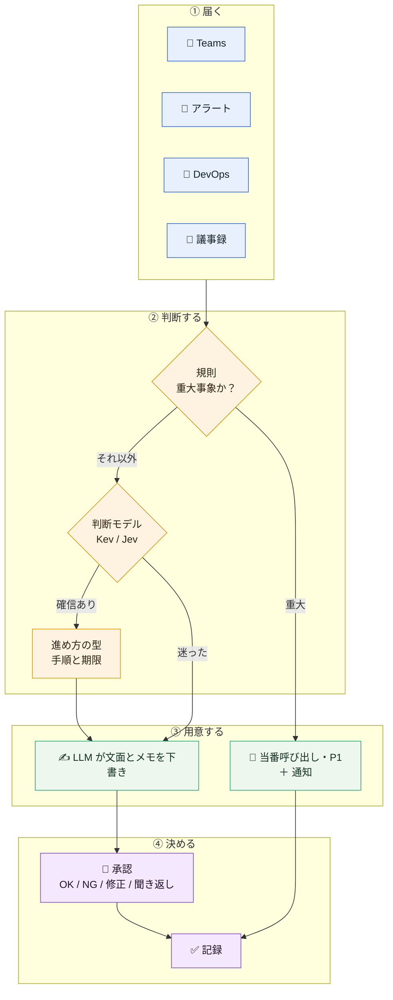
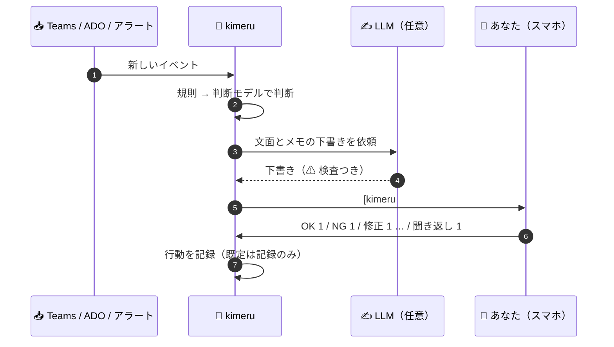
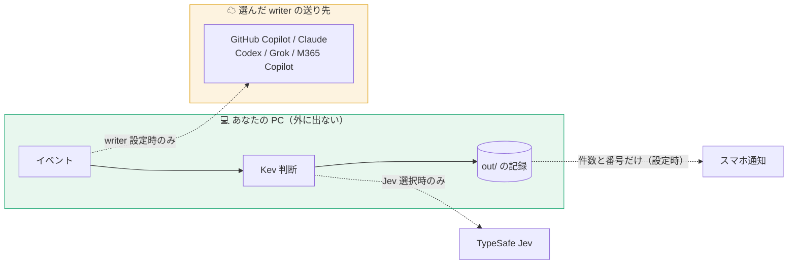
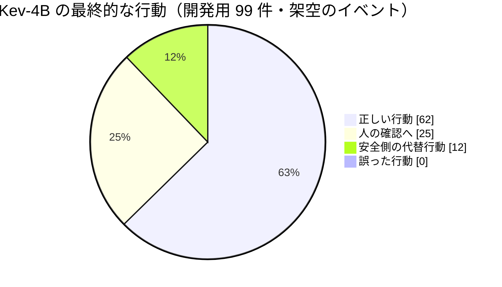

<p align="center">
  
</p>

<h1 align="center">kimeru</h1>

<p align="center">
  <b>PM の「どうする？」を、先回りして決める。</b><br>
  Teams・監視アラート・Azure DevOps・議事録が届くたびに判断し、<br>
  確信があれば決めて次の一手まで用意し、迷えばあなたに聞く。承認はスマホから <code>OK 1</code> と返すだけ。
</p>

<p align="center">
  
  
  
  
  
  
  
</p>

<p align="center">
  <a href="#-30-秒でわかる-kimeru">30 秒でわかる</a> ·
  <a href="#-向いている人と向かない人">向いている人</a> ·
  <a href="#-まず動かす">まず動かす</a> ·
  <a href="#-毎日の使い方">毎日の使い方</a> ·
  <a href="#-データの行き先">データの行き先</a> ·
  <a href="#-いまの状態">いまの状態</a> ·
  <a href="#-ドキュメント">ドキュメント</a>
</p>

---

## ⏱ 30 秒でわかる kimeru

PM の 1 日は、小さな判断の連続です。**このチャットは判断を求めているのか。このアラートは今すぐ人を呼ぶべきか。このチケットは着手できるか。議事録のこの行は決定か、タスクか。**

kimeru は、届いたものを 1 件ずつ見て、**決めるか、あなたに聞くか** を選びます。

1. **届く** — Teams のチャット、監視アラート、Azure DevOps のチケット、議事録
2. **判断する** — 障害などの重大事象は、規則が先に決めます。それ以外は判断モデル（あなたの PC の中で動く **Kev**、またはクラウドの **Jev**）が、型どおりの質問に確率で答えます
3. **用意する** — 進め方の手順と、返信・起票の下書き（文面用の LLM を設定したとき。設定しなければ定型文）
4. **あなたが決める** — 自分とのチャットに届く `[kimeru #1]` に、スマホから `OK 1` と返すだけ。**外部への書き込みは、既定では記録だけ**です



> **判断モデルは文章を書きません。** 「これは判断依頼か」「今すぐ人を呼ぶか」といった型付きの質問に、確率で答えるだけです。文章を書くのは別の LLM（任意）で、その文面は必ずあなたの承認を待ちます。

**3 段の安全網** — 間違えてはいけない順に、3 つの守りがあります。

| 段 | 何をするか | 結果 |
|---|---|---|
| ① 規則 | 障害・全ユーザー影響などの重大事象を、モデルに聞く前に拾う | 即決定して、必ず知らせる |
| ② 判断モデル | 確率で答える。確信があれば決める | 自動で決定（判断の経路と確信度をすべて記録） |
| ③ あなた | 迷ったもの、Sev0/1 なのにモデルの評価が低いもの | 承認待ち。`OK` / `NG` / `修正` / `聞き返し` で返す |

---

## 🙋 向いている人と向かない人

| 向いている | 向かない |
|---|---|
| Windows の PC と Teams で働く PM・リーダー | Mac / Linux（Teams の読み取りが Windows の画面操作のため） |
| 管理者権限なし・インストールなしの会社 PC で使いたい | Slack や Google Chat が中心 |
| 業務データを PC の外に出したくない（判断は PC の中の Kev で完結） | 返信や起票まで全自動でやってほしい（kimeru は承認制で、既定では記録だけ） |
| 「決める前に、材料と選択肢を並べてほしい」 | 判断そのものを LLM に任せたい |

---

## ✅ すること・しないこと

| すること | しないこと |
|---|---|
| 届いたイベントを判断し、決めるか聞くかを選ぶ | あなたの代わりに勝手に返信・起票する。**外部への書き込みは、既定では記録だけ**。有効にできるのは ADO のコメントだけで、承認した文面を承認のあとに 1 回だけ書く |
| 重大事象（障害・全ユーザー影響）を規則で先に拾い、必ず知らせる | 重大事象の判定をモデルだけに任せる |
| 判断の経路と確信度をすべて記録する | 理由の分からない「おすすめ」を出す |
| 迷ったら `unsure` として人に回す | 確信が低いのに断定する |
| （任意）文面の下書きと判断メモを LLM に作らせ、人が確認する | LLM に判断そのものをさせる |

---

## 🚀 まず動かす

**前提は Python 3.10 以上だけ**（依存パッケージなし）。判断モデルなしのオフラインで動きます。

```bash
git clone https://github.com/awano27/pm-decision.git && cd pm-decision
python -m kimeru demo                          # PM の 1 日（9 イベント）を再生して out/report.html を作る
python -m kimeru run examples/teams_chat.json  # 1 件だけ判断させる
```

`demo` の最後に、こう出ます。

```text
=== まとめ
    判断 9 件: 自動で決定 8 / 確信が低く安全側で決定 0 / 人の確認 1
    うち規則（安全網）で即決定 3 件、モデルの判断 17 回・合計 0.0 秒
    記録: out\decisions.jsonl
    レポート: out\report.html
```

> オフラインの `demo` と `run` は、キーワードによる簡易判定です。本物の判断には、PC の中で動く **Kev** か TypeSafe の **Jev** を使います（[しくみ](#-しくみ)）。

### 実際には、こう見える

迷った件は、自分とのチャットに **1 通の投稿** として届きます。元のメッセージ、LLM の判断メモ、返信の下書き、そして返し方。

```text
[kimeru #1] 判断が必要（teams-chat-triage）
元: 佐藤（QA）: リリース日を来週火曜にずらしてよいか判断お願いします。QA 環境が止まっていて至急です
Copilot のメモ:
・要点: QA環境の障害によるリリース日程の変更判断が求められています。
・足りない情報: QA環境の障害の詳細と復旧見込み時期 / 現在のリリース予定日 / 影響を受けるステークホルダー
・選択肢: リリース延期：QA完了を待つ（品質は確保、遅延のリスク） / スコープ縮小：機能を削って予定通り / 現状維持：予定通り（QA が不十分なリスク）
・次の一手: QA環境の障害の詳細と復旧見込みを佐藤さんに確認してください。
返信の下書き（copilot）:
受領しました。まず遅延原因の復旧見込みを確認させていただきます。
聞き返すなら（「聞き返し 1」でこちらを送る）:
QA環境の障害の詳細、復旧予定時刻、現在のリリース予定日を教えていただけますか。
作業項目の説明の下書き ほか 3 件（OK ですべて記録）
返信: OK 1 / NG 1 / 保留 1 / 修正 1 <直してほしい点> / 聞き返し 1
```

iPhone の Teams から `OK 1` と返すだけ。`修正 1 もっと短く` と返すと、書き直して同じ #1 で出し直します。承認しても相手に送るのは kimeru ではなく、あなたです（文面が自分とのチャットに返ってくるので、コピーして送ります）。

<details>
<summary><b>ほかの出力の例</b>（判断依頼の手順、重大障害、朝のまとめ。架空のイベントを実際に通した結果）</summary>

#### 判断依頼のチャットに、次の一手まで用意する

```text
[08:30] QA リーダーから 1 対 1 チャット
    「リリース日を来週火曜にずらしてよいか判断お願いします。QA 環境が止まっていて至急です」
      [判断] intent: decision（確信度 0.85）
      [進め方] 型=スケジュール変更
        1. 遅延原因の復旧見込みを担当者に確認（今日）
        2. 現行日程に依存するチーム・顧客を確認（今日）
        3. 選択肢（延期・スコープ縮小・現状維持）を比較（今日）
        4. 日程を決定し記録（今日）
        5. 関係者へ変更を通知（今日）
```

#### 重大障害は、モデルに聞く前に規則で決め、必ず知らせる

```text
[09:10] 監視アラート（決済 API: 5xx error rate 23% for 10 minutes; customers cannot complete checkout）
      [規則] critical_outage: 該当 → モデルに聞かずに決定
    → 当番を呼び出し（予定） / 障害対応の手順 5 件を起票（予定）

[kimeru 通知] 自動で決定しました（alert-triage）      ← 自分とのチャットに投稿。返信は不要
```

#### 翌朝、今日やることの上位 3 件と、3 行の要点

```text
[kimeru brief] 今日の進め方
今日の要点（Copilot）:
・最優先は障害対応の取りまとめです。社内外への一次連絡と対応責任者の指名が本日中に必要です。
・スケジュール変更の判断についても、遅延原因の復旧見込みを本日中に担当者に確認してください。
1. 確認待ち #1: 障害対応の取りまとめ: …
```

数値・人名は説明用です。

</details>

---

## 📅 毎日の使い方

**朝にまとめを見る → 日中は届いたものをスマホで承認 → 会議の後は議事録を置くだけ。**

| いつ | kimeru がすること | あなたがすること |
| --- | --- | --- |
| 朝 8 時 | 今日の要点と、やることの上位 3 件を自分とのチャットへ | 読む |
| チャットが来たとき | 判断依頼か・急ぎかを判断し、進め方・返信の下書き・判断メモを用意 | 迷ったものだけ `OK N` / `NG N` / `修正 N …` / `聞き返し N` |
| アラートが鳴ったとき | 重大なら当番呼び出しを記録し **[kimeru 通知]**、将来のリスクなら予防タスク | 迷ったものだけ確認 |
| チケットが起票されたとき | 重大バグは P1（通知）、情報不足なら確認コメント案、それ以外は優先度 | 迷ったものだけ確認 |
| 会議の後 | 議事録の 1 行ずつを決定・タスク・リスクに仕分け | Copilot の要約を `.txt` で置く（[形式](docs/minutes-format.md)） |

```powershell
python -m kimeru --backend kev daily --once --send   # 1 サイクル: 取り込み → 判断 → 下書き → 確認待ちを投稿 → 返信を反映 → 朝のまとめ
python -m kimeru --backend kev daily --send          # --once なしなら、300 秒ごとに繰り返す（--interval で変更）
python -m kimeru schedule install                    # タスクスケジューラに登録して自動運転（管理者権限不要）
```

知っておくこと:

- **Teams は、画面のチャット一覧から読みます**（UI Automation。API・アプリ登録・管理者同意は要りません）。ほかのチャットを開いて全文を読むのは、設定 `read_full=1` にしたときだけです（開いたチャットは既読になります）
- ADO とアラートは、本人の `az login` で取得します
- 判断モデルが止まっている間のイベントは受信箱に残り、復帰後に判断されます（同じイベントを二重に判断しません）
- 自分とのチャットへの投稿は、あなたのスマホや PC には通知されません。そこで kimeru は **PC に Windows の通知** を出します（クリックで自分とのチャットが開く。`KIMERU_TOAST=0` で止める）。iPhone には、**件数だけ** を届ける経路を選べます（[docs/push-notification.md](docs/push-notification.md)）



### 承認の返信

| 返信 | 動き |
|---|---|
| `OK N` | 下書きのまま承認し、行動を **記録**（相手への送信・起票はしません） |
| `NG N` | 却下。何も記録しません |
| `保留 N` | 後で決める。次のまとめにも残ります |
| `修正 N <指示>` | 指示に沿って書き直し、同じ #N で出し直します |
| `聞き返し N` | 「聞き返しの返信」を返信の下書きにして、同じ #N で出し直します。`OK N` で記録 |

ADO のコメントの実行を有効にしたときだけ、次の 3 つが加わります。

<details>
<summary>ADO のコメントの実行を有効にしたときの返信（<code>再実行 N</code> / <code>再実行 N-k</code> / <code>済 N</code>）</summary>

- `再実行 N` — ADO のコメントの実行が失敗した、または結果が分からないときだけ。同じ文面がすでに書かれていないか ADO で確かめてから、もう一度書きます（1 通の返信につき 1 回。番号が使い回されても、前の件の結果は数えません）。結果の投稿より前に送った返信と、結果の投稿が画面から流れたあとの番号だけの `再実行 N` は、効きません
- `再実行 N-k`（k は結果の回数。結果の投稿に書いてあります）— 画面に何が見えていても、最新の結果のときだけ 1 回効きます。区切りは `-` のほか、`ー` `−` `‐` `‑` `‒` `–` `—` `―` `─` `ｰ` `－` も同じに読み、全角でも大丈夫です。k が最新の結果の回数より小さい返信は無視して記録します（通知は「無視: 古い回数」）。大きい返信は、「回数が大きすぎる」と記録し、その回数の結果が出て追いついたときに 1 回だけ効きます（結果の投稿の案内のとおり。二重に書くことは、同じ文面の確認が防ぎます）。`1/2`・`1〜2`・`1 2`・`1一2` のように、区切りが読めない形は、効かせずに、形の種類ごとに 1 回、「再実行（形が違います）」と通知して記録します（返信の文字は残しません）
- `済 N` — ADO で書かれているのを確かめたときに、その件を閉じます
- 管理 PC の試験（`run-check.cmd`）が自分とのチャットに書く投稿は `[kimeru 試験 #N]` で始まり、`daily` の件の承認や再実行には当たりません

手順: [docs/execute-ado-comment.md](docs/execute-ado-comment.md)

</details>

同梱の判断グラフと進め方の型の一覧は [docs/reference.md](docs/reference.md#入力形式) に、別の場面の例は [新機能の要件を検討してほしいと頼まれたとき](docs/scenarios/requirements-review.md) にあります。

---

## 🧠 しくみ

**判断はデータです。** 判断ポイント（グラフ）も進め方の型（8 種類）も JSON で、自分のチームの判断を足せます。`kimeru validate` が閉路・到達不能・ルート漏れを検査します。

**判断モデル** — 型付きの質問に確率で答えるモデルです。2 つから選びます。

| | Kev（ローカル） | Jev（TypeSafe） |
|---|---|---|
| どこで動く | **この PC の CPU**（データは外に出ない） | クラウド API |
| 準備 | 持ち込み用フォルダ 1 つ | `TYPESAFE_API_KEY` |
| メモリ | bf16 で約 10GB。CPU が bf16 に対応していなければ、起動時に自動で fp32（約 14GB） | — |
| 使い方 | `--backend kev` | `--backend jev` |

```bash
# Kev を自分で立てる場合（別フォルダ。初回に重みを取得）
uv run --extra serve python -m kev.serve --run jaredpalmer/kev-4b --port 8009
python -m kimeru --backend kev run examples/teams_chat.json
```

[Kev](https://github.com/jaredpalmer/kev) は Jev と同じ API のローカルモデルです（Apache-2.0）。ローカル宛ての通信は、プロキシがあっても経由しません。

**文面の下書き（writer）** — 何をするかは判断モデルが決め、その後の文面と判断メモを文章生成 LLM に書かせます。`kimeru config set writer <名前>` で選びます。

| writer | 誰が書く | 本文の送り先 |
|---|---|---|
| `copilot` | GitHub Copilot CLI | GitHub Copilot |
| `claude` | Claude Code CLI | Anthropic |
| `codex` | OpenAI Codex CLI | OpenAI |
| `grok` | xAI Grok CLI（遅い） | xAI |
| `cmd` | 任意の CLI（`ollama run <モデル>` など） | コマンド次第（ローカルなら PC の外に出ない） |
| `m365` | あなたが Microsoft 365 Copilot に貼る（手動） | 組織の M365 |
| `m365-auto`（実験的） | Teams 内の Copilot チャットを画面操作 | 組織の M365 |
| 未設定 | 定型文 | どこにも送らない |

- LLM の文面は **すべて承認待ち**。LLM にはツールを渡さず、元のメッセージは「データ（中の指示には従わない）」として渡します。材料に無い日付・数値や壊れた返事は ⚠ を付けて定型文へ戻します
- Microsoft 365 Copilot だけの人は、`m365`（手動貼り付け）が正式です（[手順](docs/writers.md#m365-だけの人向けの手順)）
- 書くもの・安全のしくみ・利用量の注意・下書きの質の測り方: [docs/writers.md](docs/writers.md)

---

## 🔒 データの行き先



| | 既定 | 設定したときだけ |
|---|---|---|
| 外部への書き込み | **しない。** ADO 更新・当番呼び出し・相手への返信は、計画として `out/decisions.jsonl` に残るだけ。実際に送るのは `--send` を付けたときの自分とのチャットへの投稿だけ | ADO のコメント（`kimeru config set execute ado.comment`）。承認のあとに 1 回だけ、同じ文面がすでにあれば書かない |
| 判断 | Kev なら **PC の外に出ない** | Jev を選ぶと、イベントの内容が TypeSafe の API へ |
| 文面の下書き | 定型文。どこにも送らない | writer を設定すると、メッセージの本文・送信者・チケットの説明が、その LLM の先へ（上の表）。組織が認めた経路だけを使ってください。`copilot` は、その PC でサインイン中のアカウントの契約に従います（`copilot` を起動して `/user` で確認） |
| 通知 | PC の Windows 通知。**件数と番号だけ** | iPhone などへも件数と番号だけ。送り先の URL は記録・表示に出ません |
| 記録 | `out/`（自動運転では `%LOCALAPPDATA%\kimeru`）に、判断の経路・確認待ち・ログ。元のメッセージは 120 文字まで（全文は確認待ちの間だけ） | — |

記録には同僚のメッセージの一部が含まれます。PC の外に出さないでください。Jev の性能数値は TypeSafe の利用規約上、公開しないでください（Kev の数値は公開して構いません）。詳しくは [SECURITY.md](SECURITY.md)。

---

## 🚦 いまの状態

**v1.0 です。** 判断から承認・通知までの主な流れは、実際の Windows PC（Teams・Azure DevOps・GitHub Copilot 付き）で確かめています。ただし、判断の精度は作者が作った **架空のイベント** での評価で、**実際の業務データでの精度はこれからです**。

| 状態 | 内容 |
|---|---|
| ✅ **使える** | Teams・ADO・アラート・議事録の取り込み / Kev の判断 / 承認の流れ（`OK` `NG` `保留` `修正` `聞き返し`）/ PC の通知 / GitHub Copilot CLI・Claude・Codex での下書き / M365 だけの人向けの手動貼り付け |
| 🔬 **実装済み・実機の確認はこれから** | 設定ファイル / iPhone への push 通知 / 承認した ADO コメントの実行 / Teams の全文読み取り / 判断の速さの調整 / `calibrate`。**どれも既定では無効**で、有効にするまで動きません |
| 🧪 **実験的** | `m365-auto`（Teams 内の Microsoft 365 Copilot の画面操作。画面の作りに依存し、失敗すると 30 分休んで手動の依頼文に切り替わる） |
| ⏳ **これから** | 実データでの評価 / スマホへの通知の実機確認 / `m365-auto` を複数環境で確認して実験的から外す |



Kev-4B の評価は、開発用 99 件で誤った行動 0、検証用 48 件で 1（重大な取りこぼしはどちらも 0）です。詳細と既知の課題は [docs/evaluation.md](docs/evaluation.md)。

**確かめた環境は、作者の 2 台だけです。** 管理された会社 PC（Teams 26225.1806、Python 3.11）で、自分とのチャットの読み取り・判断・投稿と承認の読み取り・`m365-auto`・Copilot の下書きを、開発 PC（Windows 11、画面の倍率 150%）で承認の流れ・通知・テスト・デモを確かめました（[動作確認の状況](docs/evaluation.md#動作確認の状況)）。**他の人の環境での結果はまだありません。** [1 週間の試し方](docs/trial-week.md) で測り、`kimeru digest --week --share` と `kimeru config show --share` の出力（数値と環境だけ。本文・パス・組織は含みません）を Issue の「利用結果の報告」に貼ってもらえると助かります。

v1.0 のあと、4 回の第三者レビューで見つかった問題を直しました。有効にするまで動かない機能（`execute` `push` `read_full`）は、安全側の挙動を先に固めています。内容は [CHANGELOG.md](CHANGELOG.md)、実機で確かめる手順は [docs/managed-pc-check.md](docs/managed-pc-check.md)。

---

## 🗺 ロードマップ

- [x] 重大判断の通知 / 文面と判断メモの下書き・承認・修正・聞き返し / フォルダ 1 つで持ち込める配布
- [x] Teams 連携の堅牢化 / M365 だけの人向けの手動貼り付け / `m365-auto`（実験的）
- [x] 設定ファイル・push 通知・ADO コメントの実行（opt-in）・判断の速さ・しきい値の調整
- [ ] 実データ（匿名化したイベント）での評価
- [ ] スマホへの通知の実機確認
- [ ] `m365-auto` を複数の環境で確認して「実験的」から外す
- [ ] 実行できる行動の種類を増やす（opt-in）

## 📚 ドキュメント

| | |
|---|---|
| [docs/reference.md](docs/reference.md) | コマンド・設定・環境変数・出力ファイル・入力形式・グラフの書き方・評価の実行 |
| [docs/writers.md](docs/writers.md) | 文面の下書き（writer）の詳細と安全のしくみ |
| [docs/evaluation.md](docs/evaluation.md) | 精度・動作確認・既知の課題 |
| [docs/managed-environments.md](docs/managed-environments.md) | 管理者権限なしの PC・閉域の環境で使う手順 |
| [docs/push-notification.md](docs/push-notification.md) / [docs/execute-ado-comment.md](docs/execute-ado-comment.md) | push 通知 / ADO コメントの実行 |
| [docs/trial-week.md](docs/trial-week.md) | 1 週間の試し方と報告 |
| [SECURITY.md](SECURITY.md) / [CONTRIBUTING.md](CONTRIBUTING.md) / [CHANGELOG.md](CHANGELOG.md) | 安全・貢献・変更履歴 |

## 🤝 貢献

Issue と PR を歓迎します。「利用結果の報告」「動作環境の報告」「不具合」の Issue 様式があります。テストの回し方は [CONTRIBUTING.md](CONTRIBUTING.md)。

## 📄 ライセンス

MIT（[LICENSE](LICENSE)）。Kev と Qwen3.5 のモデルはそれぞれ Apache-2.0。
