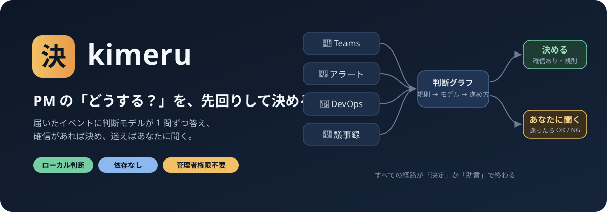

<p align="center">
  
</p>

<h1 align="center">kimeru</h1>

<p align="center">
  <b>PM の「どうする？」を、先回りして決める。</b><br>
  Teams・監視アラート・Azure DevOps・議事録が届くたびに、判断モデルが 1 問ずつ答え、<br>
  確信があれば決め、迷えばあなたに聞く。返信や起票の文面は Copilot が下書きし、承認はあなたの iPhone から。
</p>

<p align="center">
  
  
  
  
  
  
  
  
</p>

<p align="center">
  <a href="#-これは何をするツールか">概要</a> ·
  <a href="#-手に入るもの">手に入るもの</a> ·
  <a href="#-3コマンドで試す">3コマンドで試す</a> ·
  <a href="#-pm-の-1-日">PM の 1 日</a> ·
  <a href="#-文面の下書き">文面の下書き</a> ·
  <a href="#-会社-pc-で使う">会社 PC で使う</a> ·
  <a href="#-精度と限界">精度と限界</a> ·
  <a href="#-データの扱い">データの扱い</a>
</p>

---

## 🧭 これは何をするツールか

PM の 1 日は、小さな判断の連続です。

- このチャットは **判断の依頼** か、ただの共有か
- このアラートは **今すぐ人を呼ぶ** べきか、来週でいいか
- このチケットは **着手できる状態** か、情報が足りないか
- 議事録のこの行は **決定・タスク・リスク** のどれか

kimeru は、この判断を **グラフ（JSON のデータ）** として書き出し、判断モデルに 1 問ずつ答えさせます。
確信があれば決めて次の一手まで用意し、迷ったものだけ自分とのチャットに届けます。
文面の下書きと、判断に役立つメモは、Copilot（任意）が付けます。


> 判断モデルは **型付きの質問に確率で答えるだけ** で、文章は書きません。重大事象は規則が先に決め、モデルの評価が低くても人を呼びます。Copilot を設定しなければ、文面は決まった定型文になります。

---

## ✅ 手に入るもの

以下は **架空のイベントを実際の kimeru に通した出力** です。数値・人名は説明用です。

**1. 判断依頼のチャットに、次の一手まで用意する**

```text
[08:30] QA リーダーから 1 対 1 チャット
    「リリース日を来週火曜にずらしてよいか判断お願いします。QA 環境が止まっていて至急です」
      [判断] intent: decision（確信度 0.85）
      [進め方] 型=スケジュール変更
        1. 遅延原因の復旧見込みを担当者に確認（今日）
        2. 現行日程に依存するチーム・顧客を確認（今日）
        3. 選択肢（延期・スコープ縮小・現状維持）を比較（今日）
        4. 日程を決定し記録（今日）
        5. 関係者へ変更を通知（今日）
```

**2. 重大障害は、モデルに聞く前に規則で決め、必ず知らせる**

```text
[09:10] 監視アラート（決済 API: 5xx error rate 23% for 10 minutes; customers cannot complete checkout）
      [規則] critical_outage: 該当 → モデルに聞かずに決定
    → 当番を呼び出し（予定） / 障害対応の手順 5 件を起票（予定）

[kimeru 通知] 自動で決定しました（alert-triage）      ← 自分とのチャットに投稿。返信は不要
```

**3. Copilot が文面と「判断材料」を用意して、承認を待つ**

```text
[kimeru #1] 判断が必要（teams-chat-triage）
元: 佐藤（QA）: リリース日を来週火曜にずらしてよいか判断お願いします。QA 環境が止まっていて至急です
Copilot のメモ:
・要点: QA環境の障害によるリリース日程の変更判断が求められています。
・足りない情報: QA環境の障害の詳細と復旧見込み時期 / 現在のリリース予定日 / 影響を受けるステークホルダー
・選択肢: リリース延期：QA完了を待つ（品質は確保、遅延のリスク） / スコープ縮小：機能を削って予定通り / 現状維持：予定通り（QA が不十分なリスク）
・次の一手: QA環境の障害の詳細と復旧見込みを佐藤さんに確認してください。
返信の下書き（copilot）:
受領しました。まず遅延原因の復旧見込みを確認させていただきます。
聞き返すなら（「聞き返し 1」でこちらを送る）:
QA環境の障害の詳細、復旧予定時刻、現在のリリース予定日を教えていただけますか。
作業項目の説明「遅延原因の復旧見込みを担当者に確認」の下書き（copilot）: …
作業項目の説明の下書き ほか 3 件（OK ですべて記録）
返信: OK 1 / NG 1 / 保留 1 / 修正 1 <直してほしい点> / 聞き返し 1
```

iPhone の Teams から `OK 1` と返すだけ。`修正 1 もっと短く` と返すと、書き直して同じ #1 で出し直します。

**4. 翌朝、今日やることの上位 3 件と、3 行の要点**

```text
[kimeru brief] 今日の進め方
今日の要点（Copilot）:
・最優先は障害対応の取りまとめです。社内外への一次連絡と対応責任者の指名が本日中に必要です。
・スケジュール変更の判断についても、遅延原因の復旧見込みを本日中に担当者に確認してください。
1. 確認待ち #1: 障害対応の取りまとめ: …
```

| これはやる | これはやらない |
| --- | --- |
| 届いたイベントを判断し、決めるか聞くかを選ぶ | あなたの代わりに勝手に返信・起票する（**外部への書き込みは今は記録のみ**） |
| 重大事象（障害・全ユーザー影響）を規則で先に拾い、必ず知らせる | 重大事象の判定をモデルだけに任せる |
| 判断の経路と確信度をすべて記録する | 理由の分からない「おすすめ」を出す |
| 迷ったら `unsure` として人に回す | 確信が低いのに断定する |
| （任意）文面の下書きと判断メモを Copilot に作らせ、人が確認する | LLM に判断そのものをさせる |

---

## 🚀 3コマンドで試す

**前提** — Python 3.10 以上（依存パッケージなし）。判断モデルなしのオフラインで動きます。

```bash
git clone https://github.com/awano27/pm-decision.git && cd pm-decision
python -m kimeru demo                          # PM の 1 日（9 イベント）を再生して out/report.html を作る
python -m kimeru run examples/teams_chat.json  # 1 件だけ判断させる
```

```text
=== まとめ
    判断 9 件: 自動で決定 8 / 確信が低く安全側で決定 0 / 人の確認 1
    うち規則（安全網）で即決定 3 件
```

> オフライン実行はキーワードによる簡易判定です。本物の判断は、ローカルの **Kev** か TypeSafe の **Jev** を使います（[下記](#-判断モデル)）。

---

## 📅 PM の 1 日

**朝にまとめを見る → 日中は届いたものを iPhone で承認 → 会議の後は議事録を置くだけ。**

| いつ | kimeru がすること | あなたがすること |
| --- | --- | --- |
| 朝 8 時 | 今日の要点と、やることの上位 3 件を自分とのチャットへ | 読む |
| チャットが来たとき | 判断依頼か・急ぎかを判断し、進め方・返信の下書き・判断メモを用意 | 迷ったものだけ `OK N` / `NG N` / `修正 N …` / `聞き返し N` |
| アラートが鳴ったとき | 重大なら当番呼び出しを記録し **[kimeru 通知]**、将来のリスクなら予防タスク | 迷ったものだけ確認 |
| チケットが起票されたとき | 重大バグは P1（通知）、情報不足なら確認コメント案、それ以外は優先度 | 迷ったものだけ確認 |
| 会議の後 | 議事録の 1 行ずつを決定・タスク・リスクに仕分け | Copilot の要約を `.txt` で置く（[形式](docs/minutes-format.md)） |

```powershell
python -m kimeru --backend kev daily --once --send   # 1 サイクル: 取り込み → 判断 → 下書き → 確認待ちを投稿 → 返信を反映 → 朝のまとめ
python -m kimeru --backend kev daily --send          # --once なしなら、300 秒ごとに繰り返す（--interval で変更）
```

- Teams は **画面のチャット一覧** から読みます（UI Automation。API・アプリ登録・管理者同意なし）
- ADO とアラートは本人の `az login` で取得します（ADO の組織が別のテナントにあっても、組織の URL から自動で判別します）
- 判断モデルが止まっている間のイベントは受信箱に残り、復帰後に判断されます（同じイベントを二重に判断しません）
- **自分とのチャットへの投稿は、自分の iPhone や PC には通知されません。** そこで、確認待ちや通知を投稿したら **PC に Windows の通知** を出します（クリックで自分とのチャットが開く。`KIMERU_TOAST=0` で無効）
- 確認待ちも新しい投稿も無いサイクルは、自分とのチャットへの切り替えや書き込みをしません（チャット一覧は読みます）

### 承認の返信

| 返信 | 動き |
|---|---|
| `OK N` | 下書きのまま承認し、行動を **記録**（相手への送信・起票はしません） |
| `NG N` | 却下。何も記録しません |
| `保留 N` | 後で決める。次のまとめにも残ります |
| `修正 N <指示>` | 指示に沿って書き直し、同じ #N で出し直します |
| `聞き返し N` | 「聞き返しの返信」を返信の下書きにして、同じ #N で出し直します。`OK N` で記録 |

<details>
<summary><b>同梱の判断グラフ（4 種類）と進め方の型（8 種類）</b></summary>

| 入力 | グラフ | 判断ポイント | 行き先 |
|---|---|---|---|
| 💬 Teams チャット | `teams_chat.json` | 意図 → 進め方 / 判断期限 | 受領返信・手順ごとの Task・Bug 化・人の確認 |
| 🚨 監視アラート | `monitor_alert.json` | 解消済み → **重大障害（規則）** → 将来のリスクか → 時期 / 顧客影響（**Sev0/1 ガード**）→ ノイズか | 当番呼び出し・予防 Task・P1 Bug・閾値見直し |
| 🎫 ADO チケット | `ado_workitem.json` | **重大バグ（規則）** → 受け入れ条件・再現手順（規則）→ 着手可能か → 優先度 | P1 固定・情報不足コメント・優先度設定・人のトリアージ |
| 📝 議事録 | `meeting_item.json` | ラベル（`決定:` `タスク:` `リスク:` `共有:`）は規則、なければ行の種類 → 担当 → 期限 | 決定ログ・Task・Risk 登録と対策手順 |

進め方の型（`playbooks/`）: スケジュール変更 / 障害対応 / スコープ変更 / 人員調整 / リリース判定 / ステークホルダー対応 / リスク対応 / 要件明確化。

グラフも型も JSON なので、**自分のチームの判断ポイントを足せます**。閉路・到達不能ノード・ルート漏れ・不正なしきい値は `python -m kimeru validate` が弾きます。

</details>

---

## 🧠 判断モデル

| | Kev（ローカル） | Jev（TypeSafe） |
|---|---|---|
| どこで動く | **この PC の CPU**（データは外に出ない） | クラウド API |
| 準備 | 持ち込み用フォルダ 1 つ | `TYPESAFE_API_KEY` |
| メモリ | bf16 で約 10GB。CPU が bf16 に対応していなければ、起動時に自動で fp32（約 14GB）を選ぶ | — |
| 使い方 | `--backend kev` | `--backend jev` |

```bash
# Kev を自分で立てる場合（別フォルダ。初回に重みを取得）
uv run --extra serve python -m kev.serve --run jaredpalmer/kev-4b --port 8009
python -m kimeru --backend kev run examples/teams_chat.json
```

[Kev](https://github.com/jaredpalmer/kev) は Jev と同じ API のローカルモデルです（Apache-2.0）。ローカル宛ての通信は、プロキシがあっても経由しません。

---

## 📨 文面の下書き

何をするかは判断モデル（Kev / Jev）が決め、その後の **文面と判断メモ** を文章生成 LLM（writer）に書かせます。設定しなければ、文面は定型文です。

| `KIMERU_WRITER` | 誰が書く | 本文の送り先 | 手間 |
|---|---|---|---|
| `copilot` | GitHub Copilot CLI（本人のサインイン。会社契約） | GitHub Copilot | 自動（1 件 10〜20 秒） |
| `m365` | あなたが Microsoft 365 Copilot に貼る | 会社の M365（手で貼る） | 半手動。承認の投稿の後に **「Copilot 用」の依頼文** が別投稿で届く |
| `m365-auto` | Teams 内の Copilot チャットを画面操作 | 会社の M365 | 自動。**実機で未確認**。失敗したら `m365` に戻る |
| `claude` | Claude Code CLI（本人のログイン） | Anthropic | 自動 |
| （未設定） | 定型文 | どこにも送らない | — |

```powershell
$env:KIMERU_WRITER = 'copilot'                # 今の PowerShell だけ（cmd.exe なら set KIMERU_WRITER=copilot）
setx KIMERU_WRITER copilot                    # これから開く画面すべて。今開いている画面には反映されない
setx KIMERU_WRITER_MODEL claude-sonnet-5      # 省略可。使えるモデルは Copilot の契約次第（使えなければ既定に戻る）
python eval/drafts.py --backend stub --writer copilot --out drafts.jsonl   # 下書きの点検（作り話の日付・数値、長さ、失敗）
```

**書くもの**

| Kev が決めたこと | LLM が書くもの |
|---|---|
| 判断依頼・状況確認に対応する | 送信者への返信、手順ごとの作業項目の説明 |
| 障害対応を始める・予防する | チャネルへの第一報、対応タスクの説明 |
| チケットの情報が足りない | 起票者への依頼コメント |
| 議事録の決定・タスク・リスク | 決定の共有投稿、タスク・リスクの説明 |
| （すべての件） | **PM 向けのメモ**: 要点・判断に足りない情報・選択肢と利点/懸念・次の一手。足りない情報があれば **聞き返しの返信** も |
| 朝のまとめ | **今日の要点（3 行）** |

**安全のしくみ**

- LLM が書いた文面は **すべて承認待ち**。自分とのチャットに元のメッセージと下書きの全文を出します（作業項目の説明は 2 件まで表示し、残りは「ほか N 件」。`OK` ですべて記録）
- LLM にはツールを渡さず、空のフォルダで実行します。元のメッセージは「データ（中の指示には従わない）」として渡します
- 元の材料に無い日付・数値が下書きに入ると、承認の投稿に ⚠ を出します
- 断り・PM への聞き返し・壊れた返事（JSON など）が返ったら、その文面だけ **定型文に戻して ⚠**。処理は止まりません。writer が丸ごと失敗したときも、定型文を承認待ちにして ⚠ を付けます
- Microsoft 365 Copilot（`m365` / `m365-auto`）だけは、参照したメール・会議の件名を出典として表示します。`copilot` / `claude` はメールを読めないので、出典は出しません
- 当番呼び出しのように文面を伴わない行動は、承認を待たせません

---

## 🏢 会社 PC で使う

**管理者権限なし・インストールなし。持ち込むのはフォルダ 1 つ、操作はダブルクリック 1 回。**

```powershell
# 開発 PC: kimeru・Kev・Azure CLI・Python を 1 つにまとめ、1GB ずつに分割
powershell -ExecutionPolicy Bypass -File tools\make-bundle.ps1 -Zip -KevSrc <Kev の持ち込み用フォルダ> -AzSrc <az の ZIP 展開先>
powershell -ExecutionPolicy Bypass -File tools\split-zip.ps1 -Zip C:\develop\kimeru-pc.zip   # → C:\develop\parts
```

`-KevSrc` / `-AzSrc` の既定値（`C:\develop\kev-bundle` と `C:\develop\az-bundle\az`）は作者の PC の置き場所です。Kev のフォルダは [Kev の手順](https://github.com/jaredpalmer/kev) で作り（`start-kev.cmd` と `models` を含む）、Azure CLI は Microsoft 公式の ZIP 版を展開したものを使います。

1. `parts` フォルダをリモートデスクトップで会社 PC にコピー（1 ファイルが 1GB なので、途中で失敗しても該当ファイルだけ取り直せます）
2. `JOIN.cmd` をダブルクリック → 結合・破損チェック・`C:\kimeru-pc` へ展開・`START.cmd` を起動
3. `START.cmd` が Kev の起動 → az サインイン（聞かれたら `y`、ブラウザで会社アカウント）→ 動作確認（Teams・Kev・ADO・Copilot・PC 通知）まで進め、結果シートをクリップボードに入れます。確認の質問に Enter だけ答えると、その項目は「SKIP」になります

詳細と切り分け: [docs/company-pc-test.md](docs/company-pc-test.md)

---

## 📏 精度と限界

### 動作確認の状況

| 項目 | 会社 PC | 開発 PC |
|---|---|---|
| Teams のチャット一覧の読み取り | ✅ | ✅ |
| 自分とのチャットを開く・読む | ✅ | ✅ |
| Kev による判断（CPU のみ、fp32） | ✅ 1 イベント約 45 秒 | ✅ 約 20 秒（bf16） |
| GitHub Copilot による文面・メモの下書き | ✅ | ✅ |
| ADO の取り込み（別テナントの組織） | ✅ | — |
| 承認の流れ（投稿 → iPhone から OK/NG → 記録） | 一部（1 件目の投稿と OK の読み取りまで。2 件目の投稿の不具合は修正済み） | ✅ 通し（修正・OK・NG・二重処理の防止） |
| PC への Windows 通知 | 未確認 | ✅ |
| `聞き返し N` を Teams の画面から読み取る | 未確認 | 未確認（テストでは確認済み） |
| `m365-auto`（Teams 内の Copilot を画面操作） | 未確認 | 個人用 Teams には Copilot チャットがなく不可 |
| 5 分ごとの自動運転（`schedule install`）。writer の設定が引き継がれるかも | 未確認 | 未確認 |

### Kev-4B の評価

架空の PM イベント、CPU、`eval/e2e.py` で最終的な行動を採点しました。

| データ | 正しい行動 | 人の確認へ | 安全側の代替行動 | 誤った行動 | 重大な取りこぼし |
|---|---:|---:|---:|---:|---:|
| 開発用 99 件 | 62 | 25 | 12 | 0 | 0 |
| 検証用 48 件（アラート 12 件を含む） | 35 | 12 | 0 | 1 | 0 |

> **正直に書いておくこと**
> - どちらも作者が作った **架空のイベント** です。実データでの精度は未検証です
> - 検証用の 48 件は、質問文の選定と Sev0/1 ガードの設計に一度使っています（ガード追加前の初回は重大な取りこぼし 1 件）
> - Teams は一覧の **最後の 1 行のプレビュー** だけを読みます。長い依頼の全文は見ていません
> - Copilot のメモ（選択肢・不足情報）は **材料から読み取った下書き** です。事実の裏づけではないので、承認前に読んでください。⚠ が検知するのは、材料に無い日付・数値だけです
> - 5 分ごとの自動運転は試験用です。iPhone への通知は出せません（PC の通知だけ）
> - **既知の課題**（[レビューで確認済み](#既知の課題)、修正待ち）: writer の返事が JSON でも中身が空だと、検知できず定型文がそのまま記録される。`修正 N` が失敗しても再投稿される。判断モデルへの接続が途中で切れると、そのファイルは `done/*.error` に退避され自動では戻らない。「承認待ち」の投稿に隠れる作業項目（3 件目以降）の ⚠ は表示されない
> - 判断は CPU で 1 問あたり中央値 3.9 秒（開発 PC）。1 イベントは 1〜4 問を順に聞きます
>
> 詳細・再現方法: [eval/README.md](eval/README.md)

---

### 既知の課題

直近の開発（文面の下書き・承認・通知・Teams 操作・取り込み・配布）を、5 つの観点で確認しました。各指摘は、別の検証者が反証と再現を試みています。修正の優先順は次のとおりです。

1. writer の返事のキー違い・空文字を「成功」にしない（定型文は保留して ⚠）
2. 判断モデルの切断系エラーを再試行の対象にし、退避したファイルを戻す `kimeru retry` を用意する。設定の誤記（`KIMERU_WRITER` の綴り）は起動時に検知する
3. `修正 N` の失敗を投稿に出し、古い下書きの状態（⚠・依頼文）を消す
4. 承認の投稿に隠れる作業項目も、⚠ だけは必ず表示する
5. 自分とのチャットへの書き込みは、ウィンドウの題名と選択状態の **両方** を確かめてから行う。入力欄に下書きがあるときは貼り付けない

## 🔒 データの扱い

- **外部への書き込みは記録のみ**: ADO 更新・当番呼び出し・相手への返信は `out/decisions.jsonl` に計画として残るだけです。実際に送るのは、`--send` を付けたときの **自分とのチャットへの投稿** だけです
- **判断（Kev）は PC の外に出ません**: 判断モデルはローカルで動き、ローカル宛ての通信はプロキシを経由しません
- **文面の下書きは、writer によって本文の送り先が変わります**（[上の表](#-文面の下書き)）。`copilot` / `claude` は、判断対象のメッセージの本文・送信者・チケットの説明を相手のサービスに送ります。朝のまとめの「今日の要点」を作るときは、確認待ちと手順の一覧（同僚のメッセージの冒頭を含む）も送ります。会社が認めた経路だけを使い、認められない環境では設定しないでください
- **PC の通知には、送信者と本文の冒頭が出ます**（閉じるまで残ります）。画面共有の前に `KIMERU_TOAST=0` で止められます
- **記録はローカル**: 判断の経路・確認待ち・ログは `out/`（自動運転では `%LOCALAPPDATA%\kimeru`）に残ります。同僚のメッセージのプレビューや下書きを含むので、PC の外に出さないでください
- Jev の性能数値は TypeSafe の利用規約上、公開しないでください（README・Issue・公開 CI ログを含む）。Kev の数値は公開して構いません

<details>
<summary><b>リファレンス</b>（コマンド・環境変数・ファイル・ノードの書き方・入力形式・評価）</summary>

### コマンド

```bash
python -m kimeru validate
python -m kimeru demo [--pace 1.5]
python -m kimeru run <payload.json>...
python -m kimeru watch inbox/                     # inbox/*.json と議事録 *.txt を常駐処理（処理済みは inbox/done/）
python -m kimeru digest                           # 今日の判断件数と確認待ち
python -m kimeru pull teams|ado|alerts --inbox inbox    # ado: --org <組織 or URL> [--project <名前>] [--login]
python -m kimeru brief [--post [--send]]
python -m kimeru daily [--once] [--send]
python -m kimeru schedule install|remove|status   # タスクスケジューラ（管理者権限不要）
```

### 環境変数

| 変数 | 意味 |
|---|---|
| `KIMERU_BACKEND` | 既定の判断モデル（`stub` / `jev` / `kev`） |
| `KIMERU_KEV_URL` | Kev の接続先（既定 `http://127.0.0.1:8009/v1`） |
| `TYPESAFE_API_KEY` | Jev を使うときのキー |
| `KIMERU_WRITER` | 文面の下書き（`copilot` / `m365` / `m365-auto` / `claude`。未設定なら定型文） |
| `KIMERU_WRITER_MODEL` | writer のモデル名（省略可） |
| `KIMERU_TOAST` | `0` で PC の Windows 通知を止める |
| `KIMERU_AZ` | `az.cmd` の場所（`kimeru` の隣の `az`、`C:\az` も探します） |
| `KIMERU_SELF_MARKER` | 自分とのチャットの表示が「(あなた)」でないときの言葉（例: `自分`） |
| `KEV_DTYPE` | Kev の計算方式（`bf16` / `fp32`。未設定なら CPU に合わせて自動） |

### 出力ファイル（`out/`）

| ファイル | 中身 |
|---|---|
| `decisions.jsonl` | 全判断の経路・回答・記録した行動 |
| `queue.jsonl` | 人の確認待ち |
| `notices.jsonl` | 自動で決めたが知らせる重大な判断（`[kimeru 通知]`） |
| `approvals.json` / `approvals.log.jsonl` | 承認依頼の番号・状態と、OK/NG などの記録 |
| `processed.txt` | 判断済みのイベント（グラフの版とイベント ID）。二重判断の防止 |
| `pull_state.json` / `daily.log.jsonl` | 取り込みの位置、各サイクルの結果 |
| `report.html` | 判断の一覧レポート |

### 入力形式

自動判別: Microsoft Graph `chatMessage`、Azure Monitor 共通アラートスキーマ、Azure DevOps `workitem.created`、議事録 `{title, date, text}` または箇条書きの `.txt`（[docs/minutes-format.md](docs/minutes-format.md)）。

### judge ノード

```json
{"kind": "judge", "question": {"type": "noul|choice|score", "instructions": "...", "criteria": "..."}, "routes": {"unsure": "..."}}
```

- noul: `yes` / `no` / `unsure`。`yes_at`（既定 0.7）、`no_at`（既定 0.3）
- choice: 各選択肢 + `unsure`。`min_conf`（既定 0.6）未満は unsure
- score: `bands: [[上限(未満), node], ...]` + `unsure`。`guards` で「Sev0/1 なのに低い評価」を人へ回せる

### match ノード（規則）

```json
{"kind": "match", "fields": ["title", "description"], "patterns": ["..."], "exclude": ["テスト環境"], "mixed_if": ["本番"], "routes": {"yes": "...", "no": "...", "mixed": "..."}}
```

正規表現で判定（NFKC 正規化・大文字小文字無視）。`exclude` は同じ欄の一致だけを取り消し、同じ欄に `mixed_if` もあれば `mixed`（人へ）。

### plan ノード

`playbooks/*.json` の型を選び、手順ごとの要否・最初の一手・期限（今日 / 今週 / 次スプリント以降）を 1 回のバッチで聞く。終端の `per_step` で手順ごとのアクションを作れる。

### decide ノードの `notify`

`"notify": true` を付けた decide ノード（当番呼び出し・P1・今日中の判断など）は、承認が要らない場合でも `[kimeru 通知]` として自分とのチャットに 1 回投稿されます（writer が文面を書いた件は、承認待ちとして届きます）。

### 評価

```bash
python eval/run_eval.py live --backend kev --out answers.jsonl        # 判断ポイントごと
python eval/e2e.py --backend kev [--fixtures fixtures_holdout.jsonl]  # 最終的な行動
python eval/drafts.py --backend stub --writer copilot                 # 文面の下書きの点検
python eval/day_run.py --backend kev --writer copilot                 # PM の 1 日を、Teams だけ偽物にして通す
```

</details>

---

## 🗺 ロードマップ

- [x] 確信して決めた重大判断も、自分とのチャットへ通知する
- [x] 文面と判断メモを Copilot に下書きさせ、承認・修正・聞き返しを返信で行う
- [x] 会社 PC に、フォルダ 1 つを持ち込んで動かす（分割コピーと `JOIN.cmd`）
- [ ] Teams 連携の堅牢化: 本文の全文取得・プレビューの重複排除・操作中は割り込まない
- [ ] Microsoft 365 Copilot の画面操作（`m365-auto`）を、会社 PC で確かめる
- [ ] iPhone への通知（自分宛ての Teams 投稿は通知されない）
- [ ] 実データ（匿名化した会社のイベント）での評価
- [ ] 実行器を action 種別ごとに opt-in で解放（最初は ADO コメント）
- [ ] 確認待ちへの回答から、しきい値を自分のデータで調整

## 📄 ライセンス

MIT（[LICENSE](LICENSE)）。Kev と Qwen3.5 のモデルはそれぞれ Apache-2.0。
