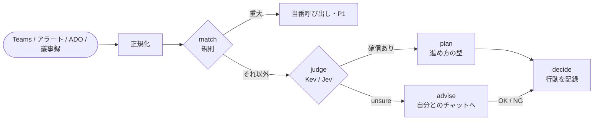

<div align="center">

# 決 kimeru

**PM の「どうする？」を、判断グラフで先回りする。**

Teams・監視アラート・Azure DevOps・議事録が届くたびに、判断モデルが型付きの質問に答え、<br>
確信があれば決め、迷えばあなたに聞く。すべての経路が **決定** か **助言** で終わる。

[](LICENSE)


</div>

---

## なぜ kimeru か

PM の 1 日は小さな判断の連続です。「このチャットは判断依頼か」「このアラートは今すぐ人を呼ぶべきか」「このチケットは着手できる状態か」。
kimeru はそれを **グラフ（データ）** として書き出し、判断モデルに 1 問ずつ答えさせます。

| | これまで | kimeru |
|---|---|---|
| 判断 | 全部を自分で読んで決める | モデルが型付きで答え、**確信度で分岐** |
| 迷うもの | 埋もれる | `unsure` の枝から **自分とのチャットに届く**（iPhone から `OK` / `NG`） |
| 重大事象 | モデル任せにすると見逃す | **規則（match）が先に判定**。Sev0/1 をモデルが軽く見たら人へ |
| 次の一手 | 頭の中 | **進め方の型（playbook）** から手順・期限を選ぶ |
| データ | クラウドへ | 判断は **ローカルモデル Kev** で完結できる |

## 仕組み



- **グラフはデータ**: `graphs/*.json` を足すだけで判断ポイントが増える。閉路・到達不能ノード・ルート漏れ・不正なしきい値は `validate` が弾く
- **判断と文章を分ける**: 判断モデルは答えるだけ。文面はテンプレート、または任意の文章生成 LLM（writer）が書き、必ず人が確認する
- **外部への書き込みは記録のみ**: ADO 更新・当番呼び出し・相手への返信は `decisions.jsonl` に計画として残るだけ（実行器は今後 opt-in で解放）

## 30 秒で試す

Python 3.10 以上、依存パッケージなし。

```bash
git clone https://github.com/awano27/pm-decision && cd pm-decision
python -m kimeru demo                            # PM の 1 日（9 イベント）をオフラインで再生し、レポートを出す
python -m kimeru run examples/teams_chat.json    # 1 件だけ判断させる
python -m unittest                               # テスト
```

```text
=== まとめ
    判断 9 件: 自動で決定 8 / 確信が低く安全側で決定 0 / 人の確認 1
    うち規則（安全網）で即決定 3 件
    レポート: out/report.html
```

オフライン実行はキーワードによる簡易判定です（精度の目安にはなりません）。

判断モデルを本物にするには、ローカルの [Kev](#ローカル判断モデルkev) か TypeSafe の Jev（`--backend jev`、`TYPESAFE_API_KEY`）を使います。

## 同梱の判断グラフ

| 入力 | グラフ | 判断ポイント | 行き先 |
|---|---|---|---|
| 💬 Teams チャット | `teams_chat.json` | 意図 → 進め方 / 判断期限 | 受領返信・手順ごとの Task・Bug 化・人の確認 |
| 🚨 監視アラート | `monitor_alert.json` | 解消済み → **重大障害（規則）** → 将来のリスクか → 時期 / 顧客影響（**Sev0/1 ガード**）→ ノイズか | 当番呼び出し・予防 Task（24h / 7 日 / それ以降）・P1 Bug・閾値見直し |
| 🎫 ADO チケット | `ado_workitem.json` | **重大バグ（規則、本番とテスト環境の混在は人へ）** → 受け入れ条件・再現手順（規則）→ 着手可能か → 優先度 | P1 固定・情報不足コメント・優先度設定・人のトリアージ |
| 📝 議事録 | `meeting_item.json` | ラベル（`決定:` `タスク:` `リスク:` `共有:`）は規則、なければ行の種類 → 担当 → 期限 | 決定ログ・Task・Risk 登録と対策手順 |

進め方の型（`playbooks/`）: スケジュール変更 / 障害対応 / スコープ変更 / 人員調整 / リリース判定 / ステークホルダー対応 / リスク対応 / 要件明確化。

## ローカル判断モデル（Kev）

社外にデータを出したくない場合は、Jev と同じ API のローカルモデル [Kev](https://github.com/jaredpalmer/kev)（Apache-2.0）を使います。CPU で動き、判断は PC の中で完結します（ローカル宛ての通信はプロキシも経由しません）。

```bash
# Kev 側（別フォルダ。初回に重みを取得）
uv sync --extra serve
uv run --extra serve python -m kev.serve --run jaredpalmer/kev-4b --port 8009
# kimeru 側
python -m kimeru --backend kev run examples/teams_chat.json   # 接続先: KIMERU_KEV_URL（既定 http://127.0.0.1:8009/v1）
```

### Kev-4B の評価（架空の PM イベント、CPU）

`eval/e2e.py` でイベントごとの**最終的な行動**を採点。正解は「行き先も予定の行動（プレイブック・優先度）も一致」、人の確認は「実際に確認待ちに入ったもの」だけを数えます。

| データ | 正しい行動 | 人の確認へ | 安全側の代替行動 | 誤った行動 | 重大な取りこぼし |
|---|---:|---:|---:|---:|---:|
| 開発用 99 件 | 62 | 25 | 12 | 0 | 0 |
| 検証用 48 件（アラート 12 件を含む） | 35 | 12 | 0 | 1 | 0 |

> [!IMPORTANT]
> - どちらも作者が作った**架空のイベント**です。実データでの精度は未検証です
> - 検証用の 48 件は、質問文の選定と Sev0/1 ガードの設計に**一度使っています**（ガード追加前の初回は重大な取りこぼし 1 件）
> - 1 問あたり CPU で中央値 3.9 秒（開発 PC）。1 イベントは 1〜4 問を順に聞きます
>
> 詳細・再現方法・限界は [eval/README.md](eval/README.md)。

## 1 日の流れ（daily）

```bash
python -m kimeru --backend kev daily --send     # 1 サイクル: 取り込み → 判断 → 確認待ちを投稿 → OK/NG を反映 → 朝のまとめ
```

- **取り込み**: Teams はチャット一覧の画面（UI Automation。API・アプリ登録・管理者同意なし）、ADO とアラートは本人の `az login`
- **確認**: 迷ったものを自分とのチャットに `[kimeru #N]` で投稿。iPhone から `OK N` / `NG N` / `保留 N`
- **朝のまとめ**: 確認待ちと今日・今週の手順を、期限と「1 日遅れたときの損害」で並べて上位 3 件
- 判断モデルが止まっている間のイベントは受信箱に残り、復帰後に判断されます（同じイベントを二重に判断しない）

> [!WARNING]
> Teams の取り込みは一覧の**最後の 1 行のプレビュー**だけを見ます。5 分ごとの自動運転（`schedule install`）は、Teams の画面を切り替えてしまう問題を直すまで試験用です。

## 文面の下書き（writer、任意）

何をするかは判断モデルが決め、返信文とチケット説明だけを文章生成 LLM に書かせます。

```bash
set KIMERU_WRITER=claude     # Claude Code CLI（本人のログイン）。未設定なら定型文
```

- LLM にはツールを渡さず、元のメッセージと判断経路だけを材料にする
- 下書きは自動送信しない。自分とのチャットに全文を出し、`修正 N もっと短く` で書き直し
- **社外に出せないデータでは使わない**（現在の実装は Claude Code CLI のみ）

## 会社 PC で動かす

管理者権限なし・インストールなし。持ち込むのはフォルダ 1 つです。

1. 開発 PC で `tools/make-bundle.ps1` → `kimeru-pc`（kimeru・Kev・Azure CLI・Python 入り、約 11GB）
2. 会社 PC にフォルダごとコピーして `START.cmd` をダブルクリック（Kev 起動 → az サインイン → 動作確認）

詳細: [docs/company-pc-test.md](docs/company-pc-test.md)

<details>
<summary><b>リファレンス</b>（コマンド・ノードの書き方・入力形式）</summary>

### コマンド

```bash
python -m kimeru validate
python -m kimeru run <payload.json>...
python -m kimeru watch inbox/                     # inbox/*.json と議事録 *.txt を常駐処理（処理済みは inbox/done/）
python -m kimeru digest                           # 今日の判断件数と確認待ち
python -m kimeru pull teams|ado|alerts --inbox inbox
python -m kimeru brief [--post [--send]]
python -m kimeru daily [--once] [--send]
python -m kimeru schedule install|remove|status   # タスクスケジューラ（管理者権限不要）
```

出力: `out/decisions.jsonl`（全判断の経路と回答）、`out/queue.jsonl`（確認待ち）。

### 入力形式

自動判別: Microsoft Graph `chatMessage`、Azure Monitor 共通アラートスキーマ、Azure DevOps `workitem.created`、議事録 `{title, date, text}` または箇条書きの `.txt`（[docs/minutes-format.md](docs/minutes-format.md)）。

### judge ノード

```json
{"kind": "judge", "question": {"type": "noul|choice|score", "instructions": "...", "criteria": "..."}, "routes": {"unsure": "..."}}
```

- noul: `yes` / `no` / `unsure`。`yes_at`（既定 0.7）、`no_at`（既定 0.3）
- choice: 各選択肢 + `unsure`。`min_conf`（既定 0.6）未満は unsure
- score: `bands: [[上限(未満), node], ...]` + `unsure`。`guards` で「Sev0/1 なのに低い評価」を人へ回せる
- `hints` はオフライン用の簡易判定専用で、判断モデルには送られない

### match ノード（規則）

```json
{"kind": "match", "fields": ["title", "description"], "patterns": ["..."], "exclude": ["テスト環境"], "mixed_if": ["本番"], "routes": {"yes": "...", "no": "...", "mixed": "..."}}
```

正規表現で判定（NFKC 正規化・大文字小文字無視）。`exclude` は同じ欄の一致だけを取り消し、同じ欄に `mixed_if` もあれば `mixed`（人へ）。

### plan ノード

`playbooks/*.json` の型を選び（choice）、手順ごとの要否・最初の一手・期限（今日 / 今週 / 次スプリント以降）を 1 回のバッチで聞く。後続で `{plan.title}` `{plan.first}`、終端の `per_step` で手順ごとのアクションを作れる。

### 評価

```bash
python eval/run_eval.py live --backend kev --out answers.jsonl   # 判断ポイントごと
python eval/e2e.py --backend kev [--fixtures fixtures_holdout.jsonl]   # 最終的な行動
python eval/compare.py a=answers_a.jsonl b=answers_b.jsonl
```

</details>

## ロードマップ

- [ ] 確信して決めた重大判断も自分とのチャットへ通知する
- [ ] Teams 連携: 操作中は割り込まない・プレビューの重複排除・送信後の確認
- [ ] 実データでの評価（匿名化した会社のイベント）と評価方法の見直し
- [ ] 実行器を action 種別ごとに opt-in で解放（最初は ADO コメント）
- [ ] 確認待ちの回答から、しきい値を自分のデータで調整

## 注意

- Jev の性能数値は TypeSafe の利用規約上、公開しないでください（README・Issue・公開 CI ログを含む）。Kev の数値は公開して構いません
- ライセンス: MIT（[LICENSE](LICENSE)）。Kev と Qwen3.5 のモデルはそれぞれ Apache-2.0
