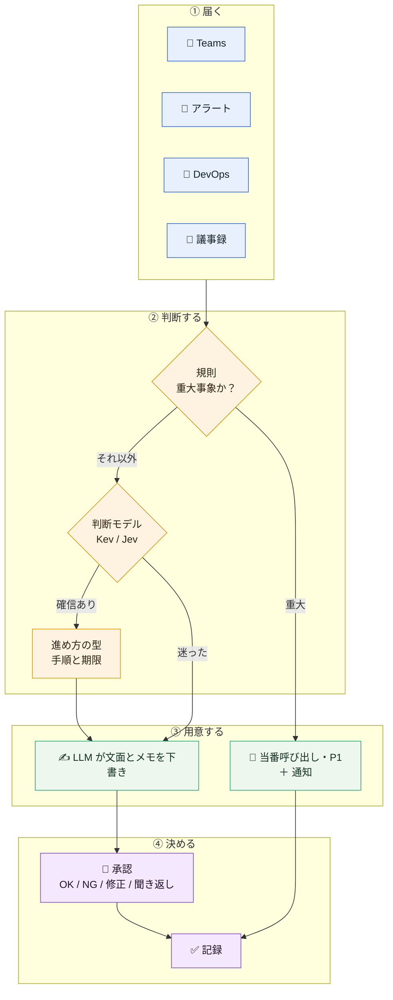
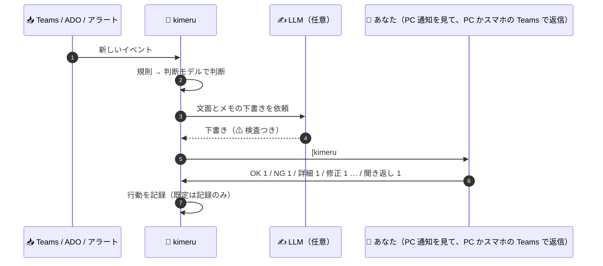
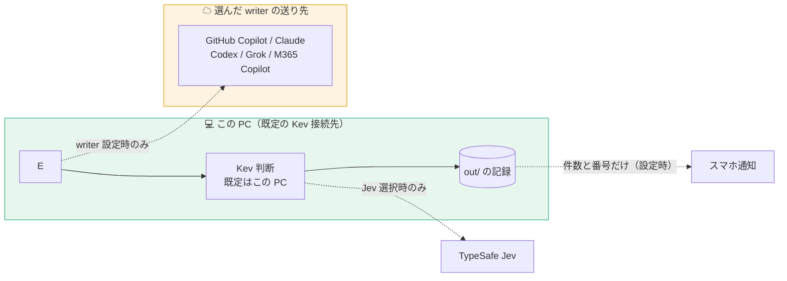
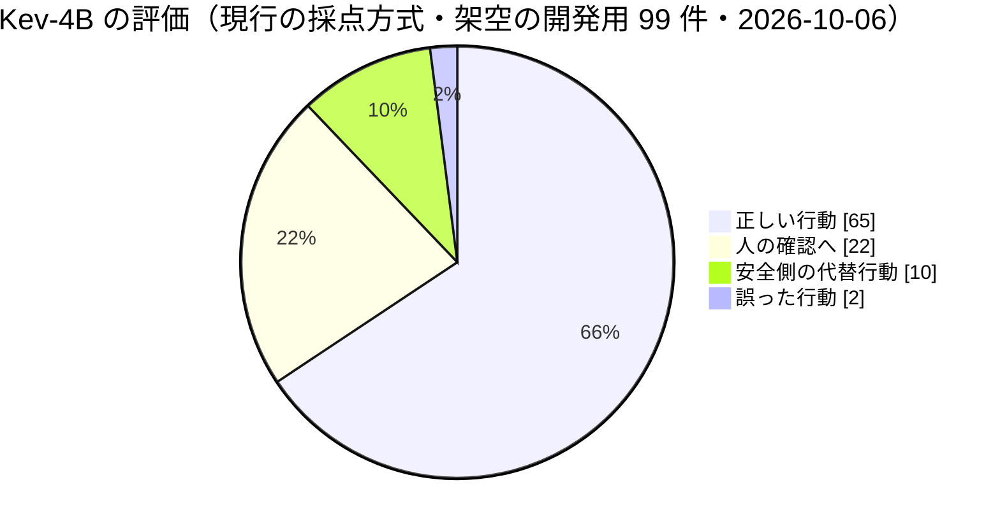

<p align="center">
  
</p>

<h1 align="center">kimeru</h1>

<p align="center"><sub>kimeru（「決める」。リポジトリ名は pm-decision・<a href="docs/naming.md">名前について</a>） — approval-first decision drafts for PMs on Windows and Teams</sub></p>

<p align="center">
  <b>PM の「どうする？」を、先回りして決める。</b><br>
  Teams・監視アラート・Azure DevOps・議事録が届くたびに判断し、<br>
  確信があれば決めて次の一手まで用意し、迷えばあなたに聞く。承認は Teams の自分とのチャットに <code>OK 1</code> と返すだけ（PC でもスマホでも）。相手へは、承認した文面をあなたがコピーして送ります。
</p>

<p align="center">
  <a href="https://github.com/awano27/pm-decision/actions/workflows/ci.yml"></a>
  
  
  
  
  
  
  
</p>

<p align="center">
  <a href="#-30-秒でわかる-kimeru">30 秒でわかる</a> ·
  <a href="#-向いている人と向かない人">向いている人</a> ·
  <a href="#-まず動かす">まず動かす</a> ·
  <a href="#-毎日の使い方">毎日の使い方</a> ·
  <a href="#-データの行き先">データの行き先</a> ·
  <a href="#-いまの状態">いまの状態</a> ·
  <a href="#-ドキュメント">ドキュメント</a>
</p>

---

## ⏱ 30 秒でわかる kimeru

PM の 1 日は、小さな判断の連続です。**このチャットは判断を求めているのか。このアラートは今すぐ人を呼ぶべきか。このチケットは着手できるか。議事録のこの行は決定か、タスクか。**

kimeru は、届いたものを 1 件ずつ見て、**決めるか、あなたに聞くか** を選びます。

1. **届く** — Teams のチャット、監視アラート、Azure DevOps のチケット、議事録
2. **判断する** — 障害などの重大事象は、規則が先に決めます。それ以外は判断モデル（この PC で動かす **Kev**〔接続先は既定でこの PC〕か、クラウドの **Jev**。`--backend` を付けないときは、キーワードによる簡易判定）が、型どおりの質問に確率で答えます。Kev にリモート接続を明示許可した場合は、その接続先へ内容を送ります
3. **用意する** — 進め方の手順と、返信・起票の下書き（文面用の LLM を設定したとき。設定しなければ定型文）
4. **あなたが決める** — 自分とのチャットに届く `[kimeru #1]` に `OK 1` と返すだけ（スマホの Teams からでも可）。合図は **PC の Windows 通知** で、スマホには通知されません（件数と番号だけを届ける経路は設定できます）。**外部への書き込みは、既定では記録だけ**。承認した返信文は自分とのチャットに戻り、相手へはあなたがコピーして送ります



> **判断モデルは文章を書きません。** 「これは判断依頼か」「今すぐ人を呼ぶか」といった型付きの質問に、確率で答えるだけです。文章を書くのは別の LLM（任意）で、その文面は必ずあなたの承認を待ちます。

**3 段の安全網** — 間違えてはいけない順に、3 つの守りがあります。

| 段 | 何をするか | 結果 |
|---|---|---|
| ① 規則 | 障害・全ユーザー影響などの重大事象を、モデルに聞く前に拾う | 即決定して、必ず知らせる |
| ② 判断モデル | 確率で答える。確信があれば決める | 自動で決定（判断の経路と確信度をすべて記録） |
| ③ あなた | 迷ったもの、Sev0/1 なのにモデルの評価が低いもの、優先度 1 の ADO をモデルが下げようとしたもの | 承認待ち。`OK` / `NG` / `修正` / `聞き返し` で返す |

---

## 🙋 向いている人と向かない人

| 向いている | 向かない |
|---|---|
| Windows の PC と Teams で働く PM・リーダー | Mac / Linux（Teams の読み取りが Windows の画面操作のため） |
| 管理者権限を使わずに動かしたい（導入は組織のルールと承認に従う） | Slack や Google Chat が中心 |
| 判断をローカル接続で行いたい（Kev の接続先をこの PC にする） | 返信や起票まで全自動でやってほしい（kimeru は承認制で、既定では記録だけ） |
| 「決める前に、材料と選択肢を並べてほしい」 | 判断そのものを LLM に任せたい |

---

## ✅ すること・しないこと

| すること | しないこと |
|---|---|
| 届いたイベントを判断し、決めるか聞くかを選ぶ | あなたの代わりに勝手に返信・起票する。**外部への書き込みは、既定では記録だけ**。有効にできるのは ADO のコメントだけで、承認した文面を承認のあとに 1 回だけ書く |
| 重大事象（障害・全ユーザー影響）を規則で先に拾い、必ず知らせる | 重大事象の判定をモデルだけに任せる |
| 判断の経路と確信度をすべて記録する | 理由の分からない「おすすめ」を出す |
| 迷ったら `unsure` として人に回す（確信が低いときに安全側の決定を記録して知らせる経路もある。[reference](docs/reference.md#judge-ノード)） | 確信が低いのに断定する |
| （任意）文面の下書きと判断メモを LLM に作らせ、人が確認する | LLM に判断そのものをさせる |

---

## 🚀 まず動かす

**前提は Python 3.10 以上と git だけ**（依存パッケージなし）。判断モデルなしのオフラインで動きます。`pip install` / `uv tool install` での導入は対応していません（判断グラフなどのデータが同梱されないため）。clone したフォルダで `python -m kimeru` を使ってください。この README の `kimeru …` は `python -m kimeru …` の略です。

```bash
git clone https://github.com/awano27/pm-decision.git && cd pm-decision
python -m kimeru demo                          # PM の 1 日（9 イベント）を約 1 分で再生して out/demo/report.html を作る（--pace 0 で待ちなし）
python -m kimeru run examples/teams_chat.json  # 1 件だけ判断させる
```

`demo` の最後に、こう出ます。

```text
=== まとめ
    判断 9 件: 自動で決定 8 / 確信が低く安全側で決定 0 / 人の確認 1
    うち規則（安全網）で即決定 3 件、モデルの判断 17 回・合計 0.0 秒
    記録: out\demo\decisions.jsonl
    レポート: out\demo\report.html
```

`demo` は専用の `out\demo` に書き、`run`・`daily`・自動運転の記録（`out\`）には触れません。デモ以外の記録があるフォルダを `--out` に指定すると、消さずに止まります（`--fresh` を付けると、その記録を `before-demo-<日時>\` へ移してから始めます）。

> オフラインの `demo` と `run` は、キーワードによる簡易判定です。本物の判断には、PC の中で動く **Kev** か TypeSafe の **Jev** を使います（[しくみ](#-しくみ)）。

### 実際には、こう見える

迷った件は、自分とのチャットに **1 通の短い投稿**（5 行ほど）として届きます。誰の何の件か、kimeru の提案（次の一手）、返信の下書き（あれば 120 字まで）、返し方。元のメッセージの全文・判断メモ・足りない情報・すべての下書きは、`詳細 N` と返すと `[kimeru 詳細 #N]` として返ってきます（判断はそのままです）。下は文面用の LLM に Copilot を設定したときの表示です（文面は説明用の例。`python examples/readme_post.py` で同じ表示を再現できます。設定しないときは、メモと下書きの代わりに定型文が入ります）。ADO のコメントの実行を有効にした件だけ、「OK で ADO にコメントを書きます」と書き込み先と文面が出ます。既定は記録だけなので、投稿には効果の説明を書きません。

```text
[kimeru #1] 佐藤（QA）さん: リリース日を来週火曜にずらしてよいか判断お願いします。QA…
→ QA 環境の障害の詳細と復旧見込みを佐藤さんに確認する
案: 受領しました。まず遅延原因の復旧見込みを確認させていただきます。
OK 1 / NG 1 / 修正 1 <点> / 聞き返し 1 / 詳細 1
```

Teams の自分とのチャットに `OK 1` と返すだけ（スマホの Teams からでも）。`修正 1 もっと短く` と返すと、書き直して同じ #1 で出し直します。承認しても相手に送るのは kimeru ではなく、あなたです（文面が自分とのチャットに返ってくるので、コピーして送ります）。

<details>
<summary><b>ほかの出力の例</b>（判断依頼の手順、重大障害、朝のまとめ。架空のイベントを実際に通した結果）</summary>

#### 判断依頼のチャットに、次の一手まで用意する

```text
[08:30] QA リーダーから 1 対 1 チャット
    「リリース日を来週火曜にずらしてよいか判断お願いします。QA 環境が止まっていて至急です」
      [判断] intent: decision（確信度 0.85）
      [進め方] 型=スケジュール変更
        1. 遅延原因の復旧見込みを担当者に確認（今日）
        2. 現行日程に依存するチーム・顧客を確認（今日）
        3. 選択肢（延期・スコープ縮小・現状維持）を比較（今日）
        4. 日程を決定し記録（今日）
        5. 関係者へ変更を通知（今日）
```

#### 重大障害は、モデルに聞く前に規則で決め、必ず知らせる

```text
[09:10] 監視アラート（決済 API: 5xx error rate 23% for 10 minutes; customers cannot complete checkout）
      [規則] critical_outage: 該当 → モデルに聞かずに決定
    → 当番を呼び出し（予定） / 障害対応の手順 5 件を起票（予定）

[kimeru 通知] 決済 API: 5xx error rate 23% for 10 minutes
→ 自動で決定しました（記録: 当番呼び出し, ADO 起票）      ← 自分とのチャットに投稿。返信は不要
```

#### 翌朝、今日やることの上位 3 件と、3 行の要点

文面用の LLM（ここでは Copilot）を設定したときの出力です。設定しないときは、要点の 3 行が付かず、上位 3 件だけになります。

```text
[kimeru brief] 今日の進め方
今日の要点（Copilot）:
・最優先は障害対応の取りまとめです。社内外への一次連絡と対応責任者の指名が本日中に必要です。
・スケジュール変更の判断についても、遅延原因の復旧見込みを本日中に担当者に確認してください。
1. 確認待ち #1: 障害対応の取りまとめ: …
```

数値・人名は説明用です。

</details>

---

## 📅 毎日の使い方

**朝にまとめを見る → 日中は PC の通知を合図に自分とのチャットで承認（スマホの Teams からでも） → 会議の後は議事録を置くだけ。**

| いつ | kimeru がすること | あなたがすること |
| --- | --- | --- |
| 朝 8 時 | 今日の要点と、やることの上位 3 件を自分とのチャットへ | 読む |
| チャットが来たとき | 判断依頼か・急ぎかを判断し、進め方・返信の下書き・判断メモを用意 | 迷ったものだけ `OK N` / `NG N` / `詳細 N`（全文を見る）/ `修正 N …` / `聞き返し N`。承認後に返る `[kimeru 送信用 #N]` の文面は、自分でコピーして相手へ送る |
| アラートが鳴ったとき | 重大なら当番呼び出しを記録し **[kimeru 通知]**、将来のリスクなら予防タスク | 迷ったものだけ確認 |
| チケットが起票されたとき | 重大バグは P1（通知）、情報不足なら確認コメント案（題名・種別・リンク付きの確認待ち。起票者は `詳細 N`。writer の有無に関係なく出る）、それ以外は優先度 | 迷ったものと情報不足だけ確認。自動で決めた P2・P3 は、朝のまとめに件数と上位 5 件で出る |
| 会議の後 | 議事録の 1 行ずつを決定・タスク・リスクに仕分け | Copilot の要約を `.txt` で置く（[形式](docs/minutes-format.md)） |

```powershell
python -m kimeru --backend kev daily --once --send   # 1 サイクル: 取り込み → 判断 → 下書き → 確認待ちを投稿 → 返信を反映 → 朝のまとめ
python -m kimeru --backend kev daily --send          # --once なしなら、300 秒ごとに繰り返す（--interval で変更）
python -m kimeru schedule install                    # タスクスケジューラに登録して自動運転（管理者権限不要。登録されるのは daily --once --send で、自分とのチャットへ実際に投稿する）
```

知っておくこと:

- **Teams は、画面のチャット一覧から読みます**（UI Automation。画面に表示されている範囲だけを読みます。組織で使う前に、画面の自動操作が認められているかを確認してください）。ほかのチャットを開いて全文を読むのは、設定 `read_full=1` にしたときだけです（開いたチャットは既読になります）
- ADO とアラートは、本人の `az login` で取得します
- 判断モデルが止まっている間のイベントは受信箱に残り、復帰後に判断されます（同じイベントを二重に判断しません）
- 自分とのチャットへの投稿は、あなたのスマホや PC には通知されません。そこで kimeru は **PC に Windows の通知** を出します（クリックで自分とのチャットが開く。`KIMERU_TOAST=0` で止める）。iPhone には、**件数と番号だけ** を届ける経路を選べます（[docs/push-notification.md](docs/push-notification.md)）



### 承認の返信

| 返信 | 動き |
|---|---|
| `OK N` | 下書きのまま承認し、行動を **記録**（相手への送信・起票はしません） |
| `NG N` | 却下。何も記録しません |
| `保留 N` | 後で決める。次のまとめにも残ります |
| `詳細 N` | 全文（元のメッセージ・判断メモ・すべての下書き・足りない情報）を `[kimeru 詳細 #N]` として返します。承認ではなく、何も記録しません。返信 1 通につき 1 回答えます |
| `修正 N <指示>` | 指示に沿って書き直し、同じ #N で出し直します |
| `聞き返し N` | 「聞き返しの返信」を返信の下書きにして、同じ #N で出し直します。`OK N` で記録 |

ADO のコメントの実行を有効にしたときだけ、次の 3 つが加わります。

<details>
<summary>ADO のコメントの実行を有効にしたときの返信（<code>再実行 N</code> / <code>再実行 N-k</code> / <code>済 N</code>）</summary>

- `再実行 N` — ADO のコメントの実行が失敗した、または結果が分からないときだけ。同じ文面がすでに書かれていないか ADO で確かめてから、もう一度書きます（1 通の返信につき 1 回。番号が使い回されても、前の件の結果は数えません）。結果の投稿より前に送った返信と、結果の投稿が画面から流れたあとの番号だけの `再実行 N` は、効きません
- `再実行 N-k`（k は結果の回数。結果の投稿に書いてあります）— 画面に何が見えていても、最新の結果のときだけ 1 回効きます。区切りは `-` のほか、`ー` `−` `‐` `‑` `‒` `–` `—` `―` `─` `ｰ` `－` も同じに読み、全角でも大丈夫です。k が最新の結果の回数より小さい返信は無視して記録します（通知は「無視: 古い回数」）。大きい返信は、「回数が大きすぎる」と記録し、その回数の結果が出て追いついたときに 1 回だけ効きます（結果の投稿の案内のとおり。二重に書くことは、同じ文面の確認が防ぎます）。`1/2`・`1〜2`・`1 2`・`1一2` のように、区切りが読めない形は、効かせずに、形の種類ごとに 1 回、「再実行（形が違います）」と通知して記録します（返信の文字は残しません）
- `済 N` — ADO で書かれているのを確かめたときに、その件を閉じます
- 管理 PC の試験（`run-check.cmd`）が自分とのチャットに書く投稿は `[kimeru 試験 #N]` で始まり、`daily` の件の承認や再実行には当たりません

手順: [docs/execute-ado-comment.md](docs/execute-ado-comment.md)

</details>

同梱の判断グラフと進め方の型の一覧は [docs/reference.md](docs/reference.md#入力形式) に、会話で新機能の要件を検討する例は [シナリオ](docs/scenarios/requirements-review.md) にあります。既存 case からローカル要件ファイルを作る操作は [要件ドラフト](docs/requirements.md) を参照してください。

### 止める・消す

```powershell
python -m kimeru schedule remove        # 自動運転のタスクを消す（残るものを表示します）
python -m kimeru config unset backend   # install のときに保存した判断モデルの既定を戻す（ado_org・ado_project も同じ）
```

- 記録の場所: この README の手順なら作業フォルダの `out\`（取り込んだ原本は `out\inbox\done\`、デモは `out\demo\`）。`setup-managed` で入れたなら `%LOCALAPPDATA%\kimeru`。同僚のメッセージの抜粋と、取り込んだ原本の全文（`daily` が既定 7 日で消す）が入っています。要らなくなったらフォルダごと消してください
- `out\run-daily.vbs`（自動運転の起動用）は `schedule remove` のあとも残ります。手で消せます
- 状態フォルダ（既定 `%LOCALAPPDATA%\kimeru`。`config.json`・`self-name.txt`・`reviews.jsonl`・`fixtures_user.jsonl` など）は `schedule remove` では消えません。消すときはフォルダごと削除します
- `setup-managed` で入れた場合は `.\setup-managed.cmd remove`（[手順](docs/managed-pc-check.md)）

### 困ったとき

| 表示・症状 | すること |
|---|---|
| 「判断モデルに接続できません」 | Kev を起動する（[しくみ](#-しくみ)）か、`--backend stub` で試す |
| 「TYPESAFE_API_KEY is not set」 | Jev の鍵を取得して設定する（[しくみ](#-しくみ)）。鍵が無ければ `--backend stub` か `kev` |
| 「判断グラフ／進め方の型のフォルダが見つかりません」 | clone したフォルダで `python -m kimeru` を実行する（pip での導入は未対応） |
| 「デモ以外の記録があります…消さずに止めました」 | デモは別の `--out` で動かす（既定は `out\demo`）。その記録を移してよければ `--fresh` |
| 取り込みに失敗した件（`inbox\done\*.error`） | 原因を直してから `python -m kimeru retry` |
| 自分とのチャットへ投稿できたか分からない件 | `python -m kimeru delivery list`、確かめてから `delivery retry` か `delivery confirm` |
| 投稿が「配信結果不明」になる・すべて PM へ回る理由を調べたい | `run-diagnose.cmd` をダブルクリック（質問しない・何も送らない。結果は数と節点の名前だけで、`kimeru-diagnose-result.txt` とクリップボード、Google ドライブの `kimeru-release` へ） |
| 発表の場で判断モデルが使えない | 前日に `demo --record <ファイル>` で記録しておき、当日は `demo --replay <ファイル>` |
| Teams のチャット一覧が 0 件と読まれる | Teams の左側の「チャット」タブを開き、一覧が見えている状態にしてから実行する |
| 毎日 `--once` を手で動かさず、時間を限って自動運転を試したい | `.\setup-managed.cmd trial`（既定 8 時間で自動的に止まり、結果ファイル `kimeru-autorun-result.txt` ができる。途中で止めるのは `.\setup-managed.cmd remove`。[手順](docs/managed-pc-check.md#毎日動く状態にする確認が-ok-だったら)） |
| 管理された PC で動くか確かめたい | `run-auto-check.cmd` をダブルクリック（何も送らない・質問しない。結果は OK/NG と件数だけ）。送信を伴う確認は `run-check.cmd`（[手順](docs/managed-pc-check.md)） |

### 最初の試行: 1 つの ADO プロジェクトで情報不足を確認

最初は対象の ADO プロジェクトを 1 つに絞り、情報が足りない作業項目の確認を記録します。`requirements build` は、case の記録と明示した回答からローカルの要件案を作り、`requirements approve` はその Markdown と JSON の現在内容をローカルで承認します。この操作は ADO や Teams の承認・状態を変更しません。手順は [要件ドラフト](docs/requirements.md) と [試行の測り方](docs/trial-week.md) にあります。

試行では、導入前後に同じ種類の確認にかかった分数、下書きをそのまま使ったか・直して使ったか・使わなかったか、本人が通知を受け取ったか、作業を手動で完了したかを記録します。ほかのシナリオは任意の追加検証です。業務上の時間短縮や判断精度はまだ測定していません。

### 待ち時間と下書き利用の計測

`out/decisions.jsonl` に判断・writer の処理秒数、下書き準備時刻、計測用の世代と出所を残し、`out/report.html` で承認記録・明示した試行記録と照合します。本文を含む通常の HTML はローカル確認用です。共有する場合は `python -m kimeru trial report --share` を使います。

| 指標 | 測るもの / 未測定のもの |
|---|---|
| 手動の確認時間 | 人が材料・下書きを読んで修正し、行動を選んだ実作業の分数を `trial record` に明示します。放置・中断の待ち時間やモデル処理時間を混ぜません。before/after は記述的な比較で、因果的な時間短縮の証明ではありません。 |
| 判断・writer の処理時間 | 既存の処理秒数です。イベントの到着から意思決定までの時間ではありません。 |
| 下書き採用率 | 利用可能な下書きがある case のうち、明示記録した最新の利用状況から `(unchanged + edited) / (unchanged + edited + unused)` を数えます。未回答の件数と観測率も表示し、`OK` や配信だけでは採用とみなしません。 |
| 投稿待ち / 観測した承認待ち | 下書き準備から自分とのチャットの本文を読み戻して確認するまでと、その確認から `OK` をアプリが受け付けるまでを分けます。後者には返信ポーリング・保留が含まれ、本人が返信した瞬間やスマホの反応時間ではありません。 |
| イベント到着から承認まで | 信頼できる到着時刻を記録していないため **Unknown / 未測定** です。手動の確認時間やモデル処理秒数で代用しません。 |

修正・貼り付け・聞き返し・追加情報で提案が変わった場合は、計測だけの世代を更新します。承認番号や承認・再実行の条件は変えません。古い記録、曖昧な配信、時刻不足・不正・逆転は `Unknown` と件数で示します。後から本人が配信を確認した時刻は元の投稿時刻には置き換えません。**実業務での下書き採用率・承認待ち短縮・時間削減効果は、まだ測定していません。**

新しい隔離フォルダで `python -m kimeru --backend stub --out <デモ専用出力先> demo --pace 0` を実行すると、待ちの演出を省いたオフライン demo と HTML を作れます。ユーザー設定を読むため、既存設定がある環境では `KIMERU_STATE_DIR` も空の試験専用フォルダに向け、外部 writer の設定を引き継がないでください。Teams はメモリ内の模擬で、実投稿はありません。計測値は `synthetic demo` と表示し、実利用・業務効果の証拠には混ぜません。

---

## 🧠 しくみ

**判断はデータです。** 判断ポイント（グラフ）も進め方の型（9 種類）も JSON で、自分のチームの判断を足せます。`kimeru validate` が閉路・到達不能・ルート漏れを検査します。

**判断モデル** — 型付きの質問に確率で答えるモデルです。2 つから選びます。`demo` と `run` を `--backend` なしで動かすと、どちらも使わないキーワードの簡易判定になります。

本物の判断を始める前に揃えるもの:

- **Kev（この PC で動かす）**: メモリ bf16 で約 10GB（fp32 なら約 14GB）、ディスク約 11GB。自分で立てるなら Python 3.12 か 3.13 と [uv](https://docs.astral.sh/uv/)（上流の前提）。ネットの無い PC へは、開発 PC で作った持ち込み用フォルダを運びます（[作り方](docs/kev-bundle.md)）。重みの取得と初回の起動にかかる時間は未測定です。CPU だけでの判断は、作者環境で 1 イベント約 20 秒（bf16）〜約 1 分（fp32）（[動作確認の状況](docs/evaluation.md#動作確認の状況)）
- **Jev（クラウド）**: TypeSafe の API キー（取得は [docs.typesafe.ai](https://docs.typesafe.ai)。費用は TypeSafe の料金に従い、このリポジトリでは扱いません）。鍵は環境変数 `TYPESAFE_API_KEY` に入れます（[設定のしかた](docs/managed-pc-check.md)）
- **管理された PC**: PowerShell が ConstrainedLanguage（組織のポリシー）だと Teams の読み取りが動きません。`run-check.cmd` の確認で SKIP と表示されます

| | Kev（既定はローカル接続） | Jev（TypeSafe） |
|---|---|---|
| どこで動く | `kev_url` の接続先。既定はこの PC。リモート接続には `kev_url_remote_ok=1` が必要 | クラウド API |
| 準備 | 持ち込み用フォルダ 1 つ（[作り方](docs/kev-bundle.md)。約 11GB） | `TYPESAFE_API_KEY`（費用は TypeSafe の料金に従う） |
| メモリ | bf16 で約 10GB。CPU が bf16 に対応していなければ、起動時に自動で fp32（約 14GB） | — |
| 使い方 | `--backend kev` | `--backend jev` |

```bash
# Kev を自分で立てる場合（別フォルダ。Python 3.12/3.13 と uv が要る。初回に重みを取得）
uv run --extra serve python -m kev.serve --run jaredpalmer/kev-4b --port 8009
# 「Uvicorn running on http://127.0.0.1:8009」と出てから実行する（接続できないと 1 行で止まる）
python -m kimeru --backend kev run examples/teams_chat.json
```

[Kev](https://github.com/jaredpalmer/kev) は Jev と同じ API のモデルです（Apache-2.0）。既定の接続はこの PC ですが、リモート接続を明示的に許可した場合は判断対象の内容がその接続先へ送られます（`kev_url_remote_ok=1`）。

**文面の下書き（writer）** — 何をするかは判断モデルが決め、その後の文面と判断メモを文章生成 LLM に書かせます。`kimeru config set writer <名前>` で選びます。

| writer | 誰が書く | 本文の送り先 |
|---|---|---|
| `copilot` | GitHub Copilot CLI | GitHub Copilot |
| `claude` | Claude Code CLI | Anthropic |
| `codex` | OpenAI Codex CLI | OpenAI |
| `grok` | xAI Grok CLI（遅い） | xAI |
| `cmd` | 任意の CLI（`ollama run <モデル>` など） | コマンド次第（ローカルなら PC の外に出ない） |
| `m365` | あなたが Microsoft 365 Copilot に貼る（手動） | 組織の M365 |
| `m365-auto`（実験的） | Teams 内の Copilot チャットを画面操作 | 組織の M365 |
| 未設定 | 定型文 | どこにも送らない |

- LLM が生成した文面は確認待ちです。Codex writer は現在、ツール利用を保証付きで無効化できないため定型文にフォールバックします。ほかの writer の実行条件はそれぞれ異なります。外部 writer に送る材料は [セキュリティ文書](SECURITY.md) を確認してください。材料に無い日付・数値や壊れた返事には ⚠ を付けます
- Microsoft 365 Copilot だけの人は、`m365`（手動貼り付け）が正式です（[手順](docs/writers.md#m365-だけの人向けの手順)）
- 書くもの・安全のしくみ・利用量の注意・下書きの質の測り方: [docs/writers.md](docs/writers.md)

---

## 🔒 データの行き先



| | 既定 | 設定したときだけ |
|---|---|---|
| 外部への書き込み | **しない。** ADO 更新・当番呼び出し・相手への返信は、計画として `out/decisions.jsonl` に残るだけ。実際に送るのは `--send` を付けたときの自分とのチャットへの投稿だけ | ADO のコメント（`kimeru config set execute ado.comment`）。承認のあとに 1 回だけ、同じ文面がすでにあれば書かない |
| 判断 | Kev の既定接続はこの PC。リモート先を明示許可した場合は、その接続先へ内容を送る | Jev を選ぶと、イベントの内容と朝のまとめの題名が TypeSafe の API へ |
| 文面の下書き | 定型文。外部 writer を呼びません | writer を設定すると、対応している provider へ材料を送ります。Codex writer は安全な no-tool 起動を保証できないため、現在は定型文にフォールバックします。任意 CLI writer は設定したコマンド次第です。組織が認めた経路だけを使ってください |
| 通知 | PC の Windows 通知。**件数と番号だけ** | iPhone などへも件数と番号だけ。送り先の URL は記録・表示に出ません |
| 記録 | `--out` のフォルダ（既定は作業フォルダの `out/`。`setup-managed` で入れた自動運転は `%LOCALAPPDATA%\kimeru`）に、判断の経路・確認待ち・ログ。判断の記録に残る元のメッセージは 120 文字まで。ただし取り込んだ原本は `inbox/done/` に全文で残り、既定 7 日で消える（`inbox_done_keep_days`。詳しくは [SECURITY.md](SECURITY.md#記録に残る範囲と期間)） | — |

記録には同僚のメッセージの一部が含まれます。PC の外に出さないでください。性能・業務効果は、再現可能な測定と利用規約を確認するまで保証しません。詳しくは [SECURITY.md](SECURITY.md)。

---

## 🚦 いまの状態

**v1.1 です。** 判断から承認・通知までの主な流れは、実際の Windows PC（Teams・Azure DevOps・GitHub Copilot 付き）で確かめています。ただし、判断の精度は作者が作った **架空のイベント** での評価で、**実際の業務データでの精度はこれからです**。

| 状態 | 内容 |
|---|---|
| ✅ **使える** | Teams・ADO・議事録の取り込み / Kev の判断 / 承認の流れ（`OK` `NG` `保留` `修正` `聞き返し`）/ PC の通知 / GitHub Copilot CLI での下書き / M365 だけの人向けの手動貼り付け（実機で確かめたもの: [動作確認の状況](docs/evaluation.md#動作確認の状況)） |
| 🔬 **実装済み・実機の確認はこれから** | 監視アラートの取り込み / Claude・Grok での下書き / 設定ファイル / iPhone への push 通知 / 承認した ADO コメントの実行 / Teams の全文読み取り / 判断の速さの調整 / `calibrate`。**どれも既定では無効**で、有効にするまで動きません |
| 🧪 **実験的** | `m365-auto`（Teams 内の Microsoft 365 Copilot の画面操作。画面の作りに依存し、失敗すると 30 分休んで手動の依頼文に切り替わる） |
| ⛔ **現在は使えない** | Codex での下書き（ツール利用を確実に無効化できないため、選んでも定型文になります） |
| ⏳ **これから** | 実データでの評価 / スマホへの通知の実機確認 / `m365-auto` を複数環境で確認して実験的から外す |



上の図は、作者が作った **架空の** 開発用 99 件を、現行の採点方式（最終の行動と手順まで一致して正しい）で採点した結果です（2026-10-06、commit cb13df1、Kev-4B（重みの取得 2026-09-26）、作者の開発 PC の CPU（bf16））。重大な取りこぼしは 0 件、誤った行動は 2 件でした。調整に使っていない検証用 48 件では、正しい行動 37・人の確認へ 10・安全側の代替 0・誤った行動 1・重大な取りこぼし 0 です。条件と内訳は [docs/evaluation.md](docs/evaluation.md#kev-4b-の評価現行の採点方式) にあります。架空のデータでの成績で、実際の業務での精度や将来の性能を保証しません。

**確かめた環境は、作者の環境だけです**（[動作確認の状況](docs/evaluation.md#動作確認の状況)）。**他の人の環境での結果はまだありません。** [1 週間の試し方](docs/trial-week.md) で測り、`kimeru digest --week --share` と `kimeru config show --share` の出力（数値と環境だけ。本文・パス・組織は含みません）を Issue の「利用結果の報告」に貼ってもらえると助かります。

v1.0 のあと、作者とは別の AI エージェントによるコードレビューを繰り返し、見つかった問題を直しました（人による外部レビューはまだありません）。有効にするまで動かない機能（`execute` `push` `read_full`）は、安全側の挙動を先に固めています。内容は [CHANGELOG.md](CHANGELOG.md)、実機で確かめる手順は [docs/managed-pc-check.md](docs/managed-pc-check.md)。

---

## 🗺 ロードマップ

- [x] 重大判断の通知 / 文面と判断メモの下書き・承認・修正・聞き返し / フォルダ 1 つで持ち込める配布
- [x] Teams 連携の堅牢化 / M365 だけの人向けの手動貼り付け / `m365-auto`（実験的）
- [x] 設定ファイル・push 通知・ADO コメントの実行（opt-in）・判断の速さ・しきい値の調整
- [x] 記録を消さないデモ・送る前の確認・データの行き先の開示・現行の採点方式での再評価・何も送らない自動の確認（v1.1）
- [ ] 実データ（匿名化したイベント）での評価
- [ ] 他の人の環境での試行（[初めて使う人の観察](docs/first-run-observation.md)・[1 週間の試し方](docs/trial-week.md)）
- [ ] スマホへの通知の実機確認
- [ ] `m365-auto` を複数の環境で確認して「実験的」から外す
- [ ] 実行できる行動の種類を増やす（opt-in）

## 📚 ドキュメント

| | |
|---|---|
| [docs/reference.md](docs/reference.md) | コマンド・設定・環境変数・出力ファイル・入力形式・グラフの書き方・評価の実行 |
| [docs/writers.md](docs/writers.md) | 文面の下書き（writer）の詳細と安全のしくみ |
| [docs/evaluation.md](docs/evaluation.md) | 精度・動作確認・既知の課題 |
| [docs/managed-environments.md](docs/managed-environments.md) | 管理者権限なしの PC・閉域の環境で使う手順 |
| [docs/managed-pc-check.md](docs/managed-pc-check.md) | 管理された PC での動作確認（何も送らない `run-auto-check.cmd`、送信を伴う `run-check.cmd`） |
| [docs/kev-bundle.md](docs/kev-bundle.md) | Kev の持ち込み用フォルダの作り方 |
| [docs/push-notification.md](docs/push-notification.md) / [docs/execute-ado-comment.md](docs/execute-ado-comment.md) | push 通知 / ADO コメントの実行 |
| [docs/trial-week.md](docs/trial-week.md) | 1 週間の試し方と報告 |
| [docs/first-run-observation.md](docs/first-run-observation.md) | 初めて使う人の観察（30 分）の手順と記録様式 |
| [docs/requirements.md](docs/requirements.md) | 要件ドラフトの作成・hash 承認と最初の試行範囲 |
| [docs/naming.md](docs/naming.md) | 名前（kimeru と pm-decision）について |
| [SECURITY.md](SECURITY.md) / [CONTRIBUTING.md](CONTRIBUTING.md) / [CHANGELOG.md](CHANGELOG.md) | 安全・貢献・変更履歴 |

## 🤝 貢献

Issue と PR を歓迎します。「利用結果の報告」「動作環境の報告」「不具合」の Issue 様式があります。テストの回し方は [CONTRIBUTING.md](CONTRIBUTING.md)。

## 📄 ライセンス

MIT（[LICENSE](LICENSE)）。Kev と Qwen3.5 のモデルはそれぞれ Apache-2.0。
