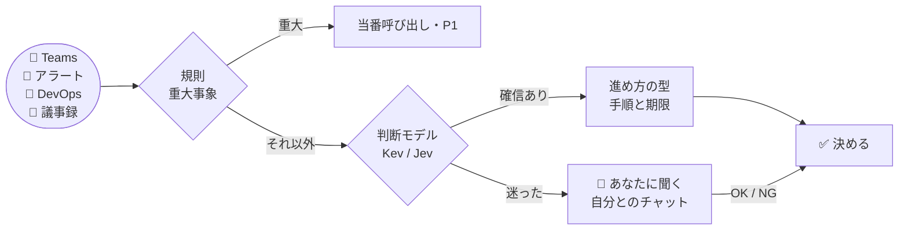

<p align="center">
  
</p>

<h1 align="center">kimeru</h1>

<p align="center">
  <b>PM の「どうする？」を、先回りして決める。</b><br>
  Teams・監視アラート・Azure DevOps・議事録が届くたびに、判断モデルが 1 問ずつ答え、<br>
  確信があれば決め、迷えばあなたの iPhone に聞く。判断は PC の中で完結できます。
</p>

<p align="center">
  
  
  
  
  
  
  
</p>

<p align="center">
  <a href="#-これは何をするツールか">概要</a> ·
  <a href="#-手に入るもの">手に入るもの</a> ·
  <a href="#-3コマンドで試す">3コマンドで試す</a> ·
  <a href="#-pm-の-1-日">PM の 1 日</a> ·
  <a href="#-会社-pc-で使う">会社 PC で使う</a> ·
  <a href="#-精度と限界">精度と限界</a> ·
  <a href="#-データの扱い">データの扱い</a>
</p>

---

## 🧭 これは何をするツールか

PM の 1 日は、小さな判断の連続です。

- このチャットは **判断の依頼** か、ただの共有か
- このアラートは **今すぐ人を呼ぶ** べきか、来週でいいか
- このチケットは **着手できる状態** か、情報が足りないか
- 議事録のこの行は **決定・タスク・リスク** のどれか

kimeru は、この判断を **グラフ（JSON のデータ）** として書き出し、判断モデルに 1 問ずつ答えさせます。
確信があれば決めて次の一手まで用意し、迷ったものだけ自分とのチャットに届けます。



> 判断モデルは **型付きの質問に確率で答えるだけ** で、文章は書きません。重大事象は規則が先に決め、モデルの評価が低くても人を呼びます。

---

## ✅ 手に入るもの

以下は **架空のイベントを実際の kimeru に通した出力** です（`python -m kimeru demo`）。数値・人名は説明用です。

**1. 判断依頼のチャットに、次の一手まで用意する**

```text
[08:30] QA リーダーから 1 対 1 チャット
    「リリース日を来週火曜にずらしてよいか判断お願いします。QA 環境が止まっていて至急です」
      [判断] intent: decision（確信度 0.85）
      [進め方] 型=スケジュール変更
        1. 遅延原因の復旧見込みを担当者に確認（今日）
        2. 現行日程に依存するチーム・顧客を確認（今日）
        3. 選択肢（延期・スコープ縮小・現状維持）を比較（今日）
        4. 日程を決定し記録（今日）
        5. 関係者へ変更を通知（今日）
    → 返信（予定）: 受領しました。まず「遅延原因の復旧見込みを担当者に確認」から進めます。
```

**2. 重大障害は、モデルに聞く前に規則で決める**

```text
[09:10] 監視アラート（決済 API: 5xx error rate 23% for 10 minutes; customers cannot complete checkout）
      [規則] critical_outage: 該当 → モデルに聞かずに決定
    → 当番を呼び出し（予定） / 障害対応の手順 5 件を起票（予定）
```

**3. 迷ったものだけ、自分とのチャットに届く**

```text
[kimeru #1] 判断が必要（minutes-followup）
内容: 分類できない議事録行（週次定例）: ログ基盤を見直す
返信: OK 1 / NG 1 / 保留 1
```

iPhone の Teams から `OK 1` と返すだけ。

**4. 翌朝、今日やることの上位 3 件**

```text
[kimeru brief] 今日の進め方
1. リスク対応計画: 発生確率と影響を評価（今日）
2. リスク対応計画: リスクオーナーを決める（今日）
3. リスク対応計画: 低減策を決める（今日）
ほか 12 件
```

| これはやる | これはやらない |
| --- | --- |
| 届いたイベントを判断し、決めるか聞くかを選ぶ | あなたの代わりに勝手に返信・起票する（**外部への書き込みは今は記録のみ**） |
| 重大事象（障害・全ユーザー影響）を規則で先に拾う | 重大事象の判定をモデルだけに任せる |
| 判断の経路と確信度をすべて記録する | 理由の分からない「おすすめ」を出す |
| 迷ったら `unsure` として人に回す | 確信が低いのに断定する |
| （任意）返信文の下書きを LLM に書かせ、人が確認する | LLM に判断そのものをさせる |

---

## 🚀 3コマンドで試す

**前提** — Python 3.10 以上（依存パッケージなし）。判断モデルなしのオフラインで動きます。

```bash
git clone https://github.com/awano27/pm-decision.git && cd pm-decision
python -m kimeru demo                          # PM の 1 日（9 イベント）を再生して out/report.html を作る
python -m kimeru run examples/teams_chat.json  # 1 件だけ判断させる
```

```text
=== まとめ
    判断 9 件: 自動で決定 8 / 確信が低く安全側で決定 0 / 人の確認 1
    うち規則（安全網）で即決定 3 件
```

> オフライン実行はキーワードによる簡易判定です。本物の判断は、ローカルの **Kev** か TypeSafe の **Jev** を使います（[下記](#-判断モデル)）。

---

## 📅 PM の 1 日

**朝にまとめを見る → 日中は届いたものを iPhone で OK/NG → 会議の後は議事録を置くだけ。**

| いつ | kimeru がすること | あなたがすること |
| --- | --- | --- |
| 朝 8 時 | 今日やることの上位 3 件を自分とのチャットへ | 読む |
| チャットが来たとき | 判断依頼か・急ぎかを判断し、進め方の手順を用意 | 迷ったものだけ `OK N` / `NG N` |
| アラートが鳴ったとき | 重大なら当番呼び出し、将来のリスクなら予防タスク | 迷ったものだけ確認 |
| チケットが起票されたとき | 重大バグは P1、情報不足なら確認コメント、それ以外は優先度 | 迷ったものだけ確認 |
| 会議の後 | 議事録の 1 行ずつを決定・タスク・リスクに仕分け | Copilot の要約を `.txt` で置く（[形式](docs/minutes-format.md)） |

```powershell
python -m kimeru --backend kev daily --send   # 1 サイクル: 取り込み → 判断 → 確認待ちを投稿 → OK/NG を反映 → 朝のまとめ
```

- Teams は **画面のチャット一覧** から読みます（UI Automation。API・アプリ登録・管理者同意なし）
- ADO とアラートは本人の `az login` で取得します
- 判断モデルが止まっている間のイベントは受信箱に残り、復帰後に判断されます（二重に判断しません）
- 自分とのチャットへの投稿は自分の端末に通知されないため、確認待ちや重大な自動決定ができたら **PC に Windows の通知** を出します（クリックで自分とのチャットが開く。`KIMERU_TOAST=0` で無効）

<details>
<summary><b>同梱の判断グラフ（4 種類）と進め方の型（8 種類）</b></summary>

| 入力 | グラフ | 判断ポイント | 行き先 |
|---|---|---|---|
| 💬 Teams チャット | `teams_chat.json` | 意図 → 進め方 / 判断期限 | 受領返信・手順ごとの Task・Bug 化・人の確認 |
| 🚨 監視アラート | `monitor_alert.json` | 解消済み → **重大障害（規則）** → 将来のリスクか → 時期 / 顧客影響（**Sev0/1 ガード**）→ ノイズか | 当番呼び出し・予防 Task・P1 Bug・閾値見直し |
| 🎫 ADO チケット | `ado_workitem.json` | **重大バグ（規則）** → 受け入れ条件・再現手順（規則）→ 着手可能か → 優先度 | P1 固定・情報不足コメント・優先度設定・人のトリアージ |
| 📝 議事録 | `meeting_item.json` | ラベル（`決定:` `タスク:` `リスク:` `共有:`）は規則、なければ行の種類 → 担当 → 期限 | 決定ログ・Task・Risk 登録と対策手順 |

進め方の型（`playbooks/`）: スケジュール変更 / 障害対応 / スコープ変更 / 人員調整 / リリース判定 / ステークホルダー対応 / リスク対応 / 要件明確化。

グラフも型も JSON なので、**自分のチームの判断ポイントを足せます**。閉路・到達不能ノード・ルート漏れ・不正なしきい値は `python -m kimeru validate` が弾きます。

</details>

---

## 🧠 判断モデル

| | Kev（ローカル） | Jev（TypeSafe） |
|---|---|---|
| どこで動く | **この PC の CPU**（データは外に出ない） | クラウド API |
| 準備 | 持ち込み用フォルダ 1 つ（約 10GB のメモリ） | `TYPESAFE_API_KEY` |
| 使い方 | `--backend kev` | `--backend jev` |

```bash
# Kev を自分で立てる場合（別フォルダ。初回に重みを取得）
uv run --extra serve python -m kev.serve --run jaredpalmer/kev-4b --port 8009
python -m kimeru --backend kev run examples/teams_chat.json
```

[Kev](https://github.com/jaredpalmer/kev) は Jev と同じ API のローカルモデル（Apache-2.0）です。ローカル宛ての通信はプロキシも経由しません。

<details>
<summary><b>文面の下書き（writer、任意）</b></summary>

何をするかは判断モデル（Kev / Jev）が決め、その後の文面だけを文章生成 LLM に書かせます。

| Kev が決めたこと | LLM が書くもの |
|---|---|
| 判断依頼・状況確認に対応する | 送信者への返信、手順ごとの作業項目の説明 |
| 障害対応を始める・予防する | チャネルへの第一報、対応タスクの説明 |
| チケットの情報が足りない | 起票者への依頼コメント |
| 議事録の決定・タスク・リスク | 決定の共有投稿、タスク・リスクの説明 |

```bash
set KIMERU_WRITER=copilot    # GitHub Copilot CLI（本人のサインイン。会社契約で使う場合はこちら）
set KIMERU_WRITER=claude     # Claude Code CLI（本人のログイン）
                             # 未設定なら定型文のまま
python eval/drafts.py --backend kev --writer copilot --out drafts.jsonl   # 下書きの点検
```

- LLM が書いた文面は **すべて承認待ち** になる。自分とのチャットに元のメッセージと下書きの全文を出し、`OK N` / `NG N` / `修正 N もっと短く`
- LLM にはツールを渡さず、空のフォルダで実行する。元のメッセージは「データ（中の指示には従わない）」として渡す
- 元の材料に無い日付・数値が下書きに入ると、承認の投稿に ⚠ で表示する
- 当番呼び出しなど文面を伴わない行動は待たせない。LLM が失敗したら定型文に戻る
- 1 件あたり 10〜20 秒（Copilot、開発 PC）。判断対象の本文が LLM のサービスに送られるので、会社が認めた経路だけを使う

</details>

---

## 🏢 会社 PC で使う

**管理者権限なし・インストールなし。持ち込むのはフォルダ 1 つ、操作はダブルクリック 1 回。**

```powershell
# 開発 PC: kimeru・Kev・Azure CLI・Python を 1 つにまとめ、1GB ずつに分割
powershell -ExecutionPolicy Bypass -File tools\make-bundle.ps1 -Zip
powershell -ExecutionPolicy Bypass -File tools\split-zip.ps1 -Zip C:\develop\kimeru-pc.zip
```

1. `parts` フォルダをリモートデスクトップで会社 PC にコピー
2. `JOIN.cmd` をダブルクリック → 結合・破損チェック・展開・Kev 起動・az サインイン・動作確認まで自動
3. 結果シートがクリップボードに入るので、そのまま共有

詳細と切り分け: [docs/company-pc-test.md](docs/company-pc-test.md)

---

## 📏 精度と限界

**Kev-4B の評価**（架空の PM イベント、CPU、`eval/e2e.py` で最終的な行動を採点）

| データ | 正しい行動 | 人の確認へ | 安全側の代替行動 | 誤った行動 | 重大な取りこぼし |
|---|---:|---:|---:|---:|---:|
| 開発用 99 件 | 62 | 25 | 12 | 0 | 0 |
| 検証用 48 件（アラート 12 件を含む） | 35 | 12 | 0 | 1 | 0 |

> **正直に書いておくこと**
> - どちらも作者が作った **架空のイベント** です。実データでの精度は未検証です
> - 検証用の 48 件は、質問文の選定と Sev0/1 ガードの設計に一度使っています（ガード追加前の初回は重大な取りこぼし 1 件）
> - Teams は一覧の **最後の 1 行のプレビュー** だけを読みます。長い依頼の全文は見ていません
> - 5 分ごとの自動運転（`schedule install`）は、Teams の画面を切り替えてしまう問題を直すまで試験用です
> - 判断は CPU で 1 問あたり中央値 3.9 秒（開発 PC）。1 イベントは 1〜4 問を順に聞きます
>
> 詳細・再現方法: [eval/README.md](eval/README.md)

---

## 🔒 データの扱い

- **外部への書き込みは記録のみ**: ADO 更新・当番呼び出し・相手への返信は `out/decisions.jsonl` に計画として残るだけです。実際に送るのは、`--send` を付けたときの **自分とのチャットへの投稿** だけです
- **Kev なら判断は PC の外に出ない**: 判断モデルはローカルで動き、ローカル宛ての通信はプロキシを経由しません
- **記録はローカル**: 判断の経路・確認待ち・ログは `out/`（自動運転では `%LOCALAPPDATA%\kimeru`）に残ります。同僚のメッセージのプレビューを含むので、PC の外に出さないでください
- Jev の性能数値は TypeSafe の利用規約上、公開しないでください（README・Issue・公開 CI ログを含む）。Kev の数値は公開して構いません

<details>
<summary><b>リファレンス</b>（コマンド・ノードの書き方・入力形式・評価）</summary>

### コマンド

```bash
python -m kimeru validate
python -m kimeru demo [--pace 1.5]
python -m kimeru run <payload.json>...
python -m kimeru watch inbox/                     # inbox/*.json と議事録 *.txt を常駐処理（処理済みは inbox/done/）
python -m kimeru digest                           # 今日の判断件数と確認待ち
python -m kimeru pull teams|ado|alerts --inbox inbox
python -m kimeru brief [--post [--send]]
python -m kimeru daily [--once] [--send]
python -m kimeru schedule install|remove|status   # タスクスケジューラ（管理者権限不要）
```

出力: `out/decisions.jsonl`（全判断の経路と回答）、`out/queue.jsonl`（確認待ち）、`out/report.html`。

### 入力形式

自動判別: Microsoft Graph `chatMessage`、Azure Monitor 共通アラートスキーマ、Azure DevOps `workitem.created`、議事録 `{title, date, text}` または箇条書きの `.txt`（[docs/minutes-format.md](docs/minutes-format.md)）。

### judge ノード

```json
{"kind": "judge", "question": {"type": "noul|choice|score", "instructions": "...", "criteria": "..."}, "routes": {"unsure": "..."}}
```

- noul: `yes` / `no` / `unsure`。`yes_at`（既定 0.7）、`no_at`（既定 0.3）
- choice: 各選択肢 + `unsure`。`min_conf`（既定 0.6）未満は unsure
- score: `bands: [[上限(未満), node], ...]` + `unsure`。`guards` で「Sev0/1 なのに低い評価」を人へ回せる

### match ノード（規則）

```json
{"kind": "match", "fields": ["title", "description"], "patterns": ["..."], "exclude": ["テスト環境"], "mixed_if": ["本番"], "routes": {"yes": "...", "no": "...", "mixed": "..."}}
```

正規表現で判定（NFKC 正規化・大文字小文字無視）。`exclude` は同じ欄の一致だけを取り消し、同じ欄に `mixed_if` もあれば `mixed`（人へ）。

### plan ノード

`playbooks/*.json` の型を選び、手順ごとの要否・最初の一手・期限（今日 / 今週 / 次スプリント以降）を 1 回のバッチで聞く。終端の `per_step` で手順ごとのアクションを作れる。

### 評価

```bash
python eval/run_eval.py live --backend kev --out answers.jsonl        # 判断ポイントごと
python eval/e2e.py --backend kev [--fixtures fixtures_holdout.jsonl]  # 最終的な行動
```

</details>

---

## 🗺 ロードマップ

- [ ] 確信して決めた重大判断も、自分とのチャットへ通知する
- [ ] Teams 連携: 操作中は割り込まない・プレビューの重複排除・送信後の確認
- [ ] 実データ（匿名化した会社のイベント）での評価
- [ ] 実行器を action 種別ごとに opt-in で解放（最初は ADO コメント）
- [ ] 確認待ちへの回答から、しきい値を自分のデータで調整

## 📄 ライセンス

MIT（[LICENSE](LICENSE)）。Kev と Qwen3.5 のモデルはそれぞれ Apache-2.0。
