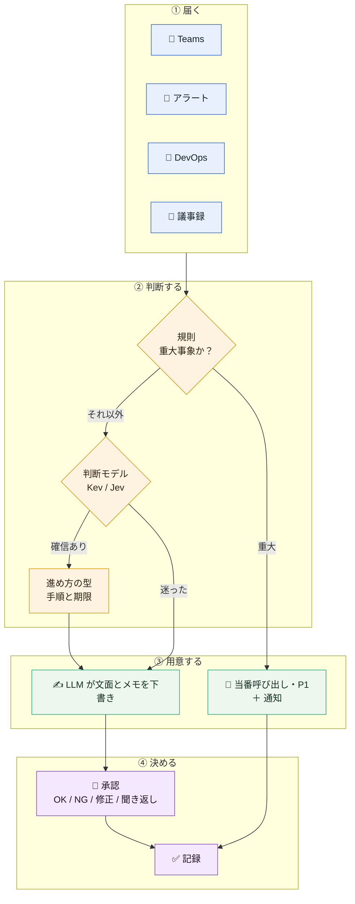
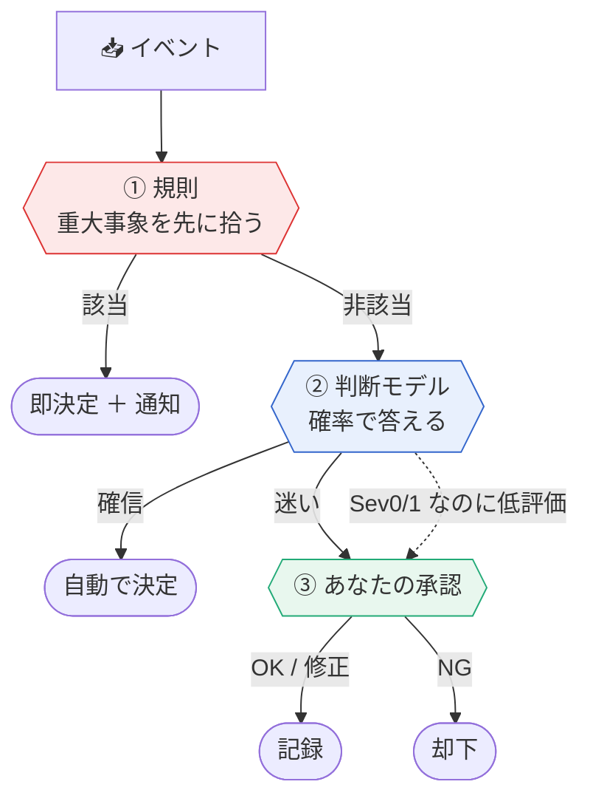
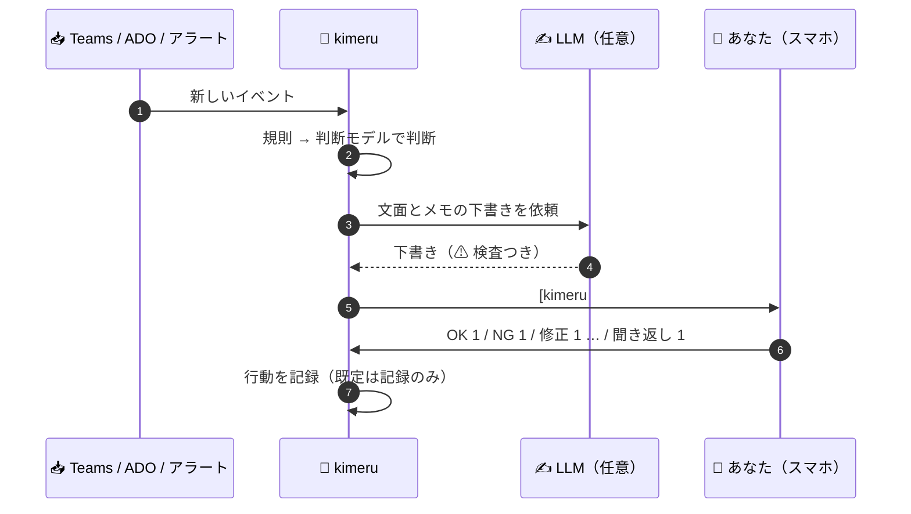
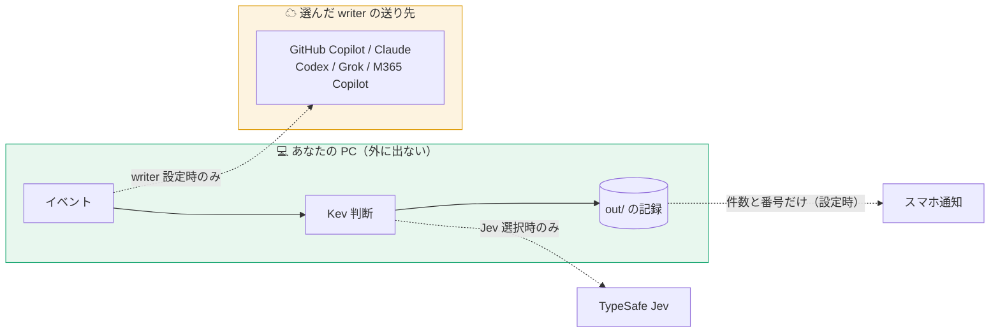
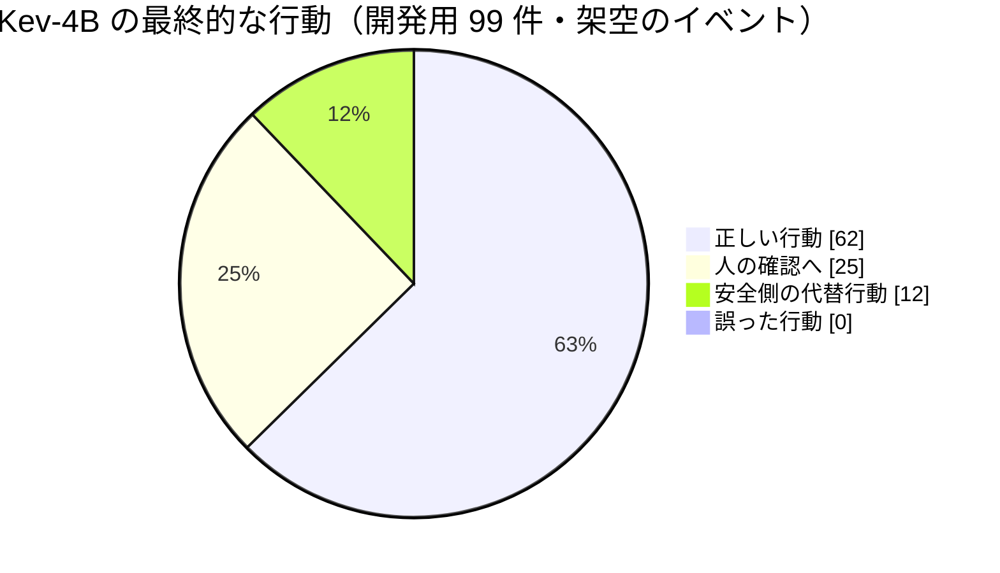
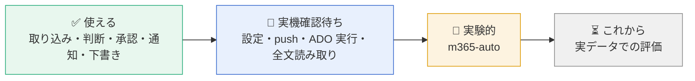

<p align="center">
  
</p>

<h1 align="center">kimeru</h1>

<p align="center">
  <b>PM の「どうする？」を、先回りして決める。</b><br>
  Teams・監視アラート・Azure DevOps・議事録が届くたびに、判断モデルが 1 問ずつ答え、<br>
  確信があれば決め、迷えばあなたに聞く。返信や起票の文面は LLM が下書きし、承認はあなたのスマホから。

<p align="center">
  
  
  
  
  
  
  
</p>

<p align="center">
  <a href="#-特徴">特徴</a> ·
  <a href="#-3コマンドで試す">試す</a> ·
  <a href="#-使い方">使い方</a> ·
  <a href="#-文面の下書き">下書き</a> ·
  <a href="#-データの扱い">データの扱い</a> ·
  <a href="#-状況と限界">状況と限界</a> ·
  <a href="#-ドキュメント">ドキュメント</a>
</p>

---

## 🧭 kimeru とは

プロダクトマネージャー（PM）の 1 日は、小さな判断の連続です。**このチャットは判断の依頼か。このアラートは今すぐ人を呼ぶべきか。このチケットは着手できるか。議事録のこの行は決定かタスクか。**

kimeru は、この判断を **グラフ（JSON）** として書き出し、判断モデルに 1 問ずつ答えさせます。確信があれば決めて次の一手まで用意し、迷ったものだけを **あなたの承認待ち** にします。

- 入力: Teams のチャット・監視アラート・Azure DevOps のチケット・議事録
- 判断: ローカルの **Kev**（データは PC の外に出ない）または TypeSafe の **Jev**
- 文面: GitHub Copilot / Claude / Codex などの LLM（任意）が返信・起票の下書きと判断メモを作る
- 承認: 自分宛てチャットへ届く `[kimeru #N]` に、スマホから `OK N` と返すだけ
- 外部への書き込みは **既定で記録のみ**（実行は、設定した種類だけ・承認のあと）



> 判断モデルは **型付きの質問に確率で答えるだけ** で、文章は書きません。重大事象は規則が先に決め、モデルの評価が低くても人を呼びます。文面用の LLM を設定しなければ、文面は決まった定型文になります。

---

### 3 段の安全網



---

## ✨ 特徴

| | できること |
|---|---|
| 🧩 **判断をデータで書く** | 判断ポイントも進め方の型（8 種類）も JSON。自分のチームの判断を足せる。`kimeru validate` が閉路・到達不能・ルート漏れを検査 |
| 🛡 **重大事象は規則が先に決める** | 障害・全ユーザー影響などは、モデルに聞く前に決めて必ず知らせる。Sev0/1 なのに低評価なら人へ回す |
| 🙋 **迷ったら人に聞く** | 確信が低いものは `unsure` として承認待ちへ。判断の経路と確信度を全部記録 |
| 🔒 **ローカルで判断できる** | Kev は自分の PC の CPU で動く。ネットワークなし・依存パッケージなしで、デモも動く |
| ✍ **下書きは承認制** | LLM の文面は必ず承認待ち。材料に無い日付・数値・断り・壊れた返事は ⚠ を付けて定型文へ戻す |
| ⚙ **設定・通知・実行を選べる** | `config.json` で設定、件数だけの push 通知、承認した ADO コメントの実行（どれも既定は無効） |
| 🏢 **制限のある PC でも動く** | 管理者権限なし・インストールなし。フォルダ 1 つを持ち込んで使える（[手順](docs/managed-environments.md)） |

---

## 🚀 3コマンドで試す

**前提** — Python 3.10 以上（依存パッケージなし）。判断モデルなしのオフラインで動きます。

```bash
git clone https://github.com/awano27/pm-decision.git && cd pm-decision
python -m kimeru demo                          # PM の 1 日（9 イベント）を再生して out/report.html を作る
python -m kimeru run examples/teams_chat.json  # 1 件だけ判断させる
```

```text
=== まとめ
    判断 9 件: 自動で決定 8 / 確信が低く安全側で決定 0 / 人の確認 1
    うち規則（安全網）で即決定 3 件
```

> オフライン実行はキーワードによる簡易判定です。本物の判断には、ローカルの **Kev** か TypeSafe の **Jev** を使います（[下記](#-判断モデル)）。

### 出力の例（架空のイベントを実際に通した結果）

以下は **架空のイベントを実際の kimeru に通した出力** です。数値・人名は説明用です。

#### 1. 判断依頼のチャットに、次の一手まで用意する

```text
[08:30] QA リーダーから 1 対 1 チャット
    「リリース日を来週火曜にずらしてよいか判断お願いします。QA 環境が止まっていて至急です」
      [判断] intent: decision（確信度 0.85）
      [進め方] 型=スケジュール変更
        1. 遅延原因の復旧見込みを担当者に確認（今日）
        2. 現行日程に依存するチーム・顧客を確認（今日）
        3. 選択肢（延期・スコープ縮小・現状維持）を比較（今日）
        4. 日程を決定し記録（今日）
        5. 関係者へ変更を通知（今日）
```

#### 2. 重大障害は、モデルに聞く前に規則で決め、必ず知らせる

```text
[09:10] 監視アラート（決済 API: 5xx error rate 23% for 10 minutes; customers cannot complete checkout）
      [規則] critical_outage: 該当 → モデルに聞かずに決定
    → 当番を呼び出し（予定） / 障害対応の手順 5 件を起票（予定）

[kimeru 通知] 自動で決定しました（alert-triage）      ← 自分とのチャットに投稿。返信は不要
```

#### 3. Copilot が文面と「判断材料」を用意して、承認を待つ

```text
[kimeru #1] 判断が必要（teams-chat-triage）
元: 佐藤（QA）: リリース日を来週火曜にずらしてよいか判断お願いします。QA 環境が止まっていて至急です
Copilot のメモ:
・要点: QA環境の障害によるリリース日程の変更判断が求められています。
・足りない情報: QA環境の障害の詳細と復旧見込み時期 / 現在のリリース予定日 / 影響を受けるステークホルダー
・選択肢: リリース延期：QA完了を待つ（品質は確保、遅延のリスク） / スコープ縮小：機能を削って予定通り / 現状維持：予定通り（QA が不十分なリスク）
・次の一手: QA環境の障害の詳細と復旧見込みを佐藤さんに確認してください。
返信の下書き（copilot）:
受領しました。まず遅延原因の復旧見込みを確認させていただきます。
聞き返すなら（「聞き返し 1」でこちらを送る）:
QA環境の障害の詳細、復旧予定時刻、現在のリリース予定日を教えていただけますか。
作業項目の説明「遅延原因の復旧見込みを担当者に確認」の下書き（copilot）: …
作業項目の説明の下書き ほか 3 件（OK ですべて記録）
返信: OK 1 / NG 1 / 保留 1 / 修正 1 <直してほしい点> / 聞き返し 1
```

iPhone の Teams から `OK 1` と返すだけ。`修正 1 もっと短く` と返すと、書き直して同じ #1 で出し直します。

#### 4. 翌朝、今日やることの上位 3 件と、3 行の要点

```text
[kimeru brief] 今日の進め方
今日の要点（Copilot）:
・最優先は障害対応の取りまとめです。社内外への一次連絡と対応責任者の指名が本日中に必要です。
・スケジュール変更の判断についても、遅延原因の復旧見込みを本日中に担当者に確認してください。
1. 確認待ち #1: 障害対応の取りまとめ: …
```

| これはやる | これはやらない |
| --- | --- |
| 届いたイベントを判断し、決めるか聞くかを選ぶ | あなたの代わりに勝手に返信・起票する（**外部への書き込みは今は記録のみ**） |
| 重大事象（障害・全ユーザー影響）を規則で先に拾い、必ず知らせる | 重大事象の判定をモデルだけに任せる |
| 判断の経路と確信度をすべて記録する | 理由の分からない「おすすめ」を出す |
| 迷ったら `unsure` として人に回す | 確信が低いのに断定する |
| （任意）文面の下書きと判断メモを Copilot に作らせ、人が確認する | LLM に判断そのものをさせる |

---

---

## 📅 使い方

**朝にまとめを見る → 日中は届いたものをスマホで承認 → 会議の後は議事録を置くだけ。**

| いつ | kimeru がすること | あなたがすること |
| --- | --- | --- |
| 朝 8 時 | 今日の要点と、やることの上位 3 件を自分とのチャットへ | 読む |
| チャットが来たとき | 判断依頼か・急ぎかを判断し、進め方・返信の下書き・判断メモを用意 | 迷ったものだけ `OK N` / `NG N` / `修正 N …` / `聞き返し N` |
| アラートが鳴ったとき | 重大なら当番呼び出しを記録し **[kimeru 通知]**、将来のリスクなら予防タスク | 迷ったものだけ確認 |
| チケットが起票されたとき | 重大バグは P1（通知）、情報不足なら確認コメント案、それ以外は優先度 | 迷ったものだけ確認 |
| 会議の後 | 議事録の 1 行ずつを決定・タスク・リスクに仕分け | Copilot の要約を `.txt` で置く（[形式](docs/minutes-format.md)） |

```powershell
python -m kimeru --backend kev daily --once --send   # 1 サイクル: 取り込み → 判断 → 下書き → 確認待ちを投稿 → 返信を反映 → 朝のまとめ
python -m kimeru --backend kev daily --send          # --once なしなら、300 秒ごとに繰り返す（--interval で変更）
```

- Teams は **画面のチャット一覧** から読みます（UI Automation。API・アプリ登録・管理者同意なし）
- ADO とアラートは本人の `az login` で取得します（ADO の組織が別のテナントにあっても、組織の URL から自動で判別します）
- 判断モデルが止まっている間のイベントは受信箱に残り、復帰後に判断されます（同じイベントを二重に判断しません）
- **自分とのチャットへの投稿は、自分の iPhone や PC には通知されません。** そこで、確認待ちや通知を投稿したら **PC に Windows の通知** を出します（クリックで自分とのチャットが開く。`KIMERU_TOAST=0` で無効）。iPhone には、Teams の Workflows などで **件数だけ** を届ける経路を選べます（[docs/push-notification.md](docs/push-notification.md)）
- 確認待ちも新しい投稿も無いサイクルは、自分とのチャットへの切り替えや書き込みをしません（チャット一覧は読みます）。**既定はこのままです。** 設定 `read_full=1` にしたときだけ、必要な件に限って、他のチャットを開いて全文を読みます（下記「Teams の本文を全文で読む」。開いたチャットは、Teams で既読になります）



### 承認の返信

| 返信 | 動き |
|---|---|
| `OK N` | 下書きのまま承認し、行動を **記録**（相手への送信・起票はしません） |
| `NG N` | 却下。何も記録しません |
| `保留 N` | 後で決める。次のまとめにも残ります |
| `修正 N <指示>` | 指示に沿って書き直し、同じ #N で出し直します |
| `聞き返し N` | 「聞き返しの返信」を返信の下書きにして、同じ #N で出し直します。`OK N` で記録 |

グラフと進め方の型は [リファレンス](docs/reference.md#同梱の判断グラフと進め方の型) に一覧があります。別の場面の例: [新機能の要件を検討してほしいと頼まれたとき](docs/scenarios/requirements-review.md)。

---

## 🧠 判断モデル

| | Kev（ローカル） | Jev（TypeSafe） |
|---|---|---|
| どこで動く | **この PC の CPU**（データは外に出ない） | クラウド API |
| 準備 | 持ち込み用フォルダ 1 つ | `TYPESAFE_API_KEY` |
| メモリ | bf16 で約 10GB。CPU が bf16 に対応していなければ、起動時に自動で fp32（約 14GB）を選ぶ | — |
| 使い方 | `--backend kev` | `--backend jev` |

```bash
# Kev を自分で立てる場合（別フォルダ。初回に重みを取得）
uv run --extra serve python -m kev.serve --run jaredpalmer/kev-4b --port 8009
python -m kimeru --backend kev run examples/teams_chat.json
```

[Kev](https://github.com/jaredpalmer/kev) は Jev と同じ API のローカルモデルです（Apache-2.0）。ローカル宛ての通信は、プロキシがあっても経由しません。

---

---

## 📨 文面の下書き

何をするかは判断モデルが決め、その後の **文面と判断メモ** を文章生成 LLM（writer）に書かせます。`KIMERU_WRITER`（または `kimeru config set writer <名前>`）で選びます。

| writer | 誰が書く | 本文の送り先 |
|---|---|---|
| `copilot` | GitHub Copilot CLI | GitHub Copilot |
| `claude` | Claude Code CLI | Anthropic |
| `codex` | OpenAI Codex CLI（`gpt-6-luna` に固定） | OpenAI |
| `grok` | xAI Grok CLI（遅い） | xAI |
| `cmd` | 任意の CLI（`ollama run <モデル>` など） | コマンド次第（ローカルなら PC の外に出ない） |
| `m365` | あなたが Microsoft 365 Copilot に貼る（手動） | 組織の M365 |
| `m365-auto`（実験的） | Teams 内の Copilot チャットを画面操作 | 組織の M365 |
| 未設定 | 定型文 | どこにも送らない |

- LLM の文面は **すべて承認待ち**。LLM にはツールを渡さず、元のメッセージは「データ（中の指示には従わない）」として渡します
- Microsoft 365 Copilot だけの人は、`m365`（手動貼り付け）が正式です。手順は [docs/writers.md](docs/writers.md#m365-だけの人向けの手順)
- 書くもの・安全のしくみ・利用量の注意・下書きの質の測り方: [docs/writers.md](docs/writers.md)

---

### 本文はどこへ行くか



## 🔒 データの扱い

- **既定は記録のみ。有効にした種類（今は ADO のコメントだけ）だけを、承認のあとに実行する。相手への返信は送らない**: ADO 更新・当番呼び出し・相手への返信は `out/decisions.jsonl` に計画として残るだけです。実際に送るのは、`--send` を付けたときの自分とのチャットへの投稿だけです（相手への返信は、承認すると、送る文面だけが自分とのチャットに返ります。コピーして、あなたが送ります）。ADO のコメントは `kimeru config set execute ado.comment` で有効にしたときだけ、承認（`OK N`）のあとに 1 回だけ書きます（[手順](docs/execute-ado-comment.md)）。通知の経路を設定したときは、**件数と番号だけ**（本文・送信者・件名は含みません）を、あなたが指定した先へ送ります
- **判断（Kev）は PC の外に出ません**: 判断モデルはローカルで動き、ローカル宛ての通信はプロキシを経由しません
- **文面の下書きは、writer によって本文の送り先が変わります**（[上の表](#-文面の下書き)）。`copilot` / `claude` は、判断対象のメッセージの本文・送信者・チケットの説明を相手のサービスに送ります。朝のまとめの「今日の要点」を作るときは、確認待ちと手順の一覧（同僚のメッセージの冒頭を含む）も送ります。組織が認めた経路だけを使い、認められない環境では設定しないでください。`copilot` は、その PC の `copilot` にサインインしているアカウントの契約に従います（個人の無料アカウントでも動くため、業務のメッセージを送る前に、`copilot` を起動して `/user` でどのアカウントか確かめてください）
- **PC の通知**（既定）は、件数と番号だけです（`KIMERU_TOAST=detail` にすると、この PC の画面にだけ、先頭の 1 件の要約が出ます）。画面共有の前に `KIMERU_TOAST=0` で止められます
- **iPhone などへの通知**（設定したときだけ）: 行き先ごとにデータの行き先が違います。どれも、件数と番号だけを送ります
  - `teams_webhook`: あなたが Teams の Workflows で作った流れの URL（Microsoft 365 の中）
  - `webhook`: あなたが指定した URL（行き先のサービスの規約に従います）
  - `outlook`: デスクトップ版の Outlook から、あなた自身へのメール
  - URL は環境変数だけで受け取り、記録・表示・エラー文に出しません
- **記録はローカル**: 判断の経路・確認待ち・ログは `out/`（自動運転では `%LOCALAPPDATA%\kimeru`）に残ります。同僚のメッセージのプレビューや下書きを含むので、PC の外に出さないでください
- Jev の性能数値は TypeSafe の利用規約上、公開しないでください（README・Issue・公開 CI ログを含む）。Kev の数値は公開して構いません

詳しくは [SECURITY.md](SECURITY.md)。

---

## 🚦 状況と限界

**v1.0 です。** 判断から承認・通知までの主な流れは、実際の Windows PC（Teams・Azure DevOps・GitHub Copilot 付き）で確かめています。ただし、判断の精度は作者が作った **架空のイベント** での評価で、**実際の業務データでの精度はこれからです**。

| 状態 | 内容 |
|---|---|
| ✅ **使える** | Teams・ADO・アラート・議事録の取り込みと Kev の判断 / 承認の流れ（`OK N` / `NG N` / `保留 N` / `修正 N` / `聞き返し N`）/ PC の通知 / GitHub Copilot CLI・Claude・Codex での下書き / M365 だけの人向けの手動貼り付け（`m365`）/ 外部への書き込みは記録のみ |
| 🧪 **実験的** | `m365-auto`（Teams 内の Microsoft 365 Copilot の画面操作。画面の作りに依存し、失敗すると 30 分休んで手動の依頼文に切り替わる）|
| 🔬 **実装済み・実機の確認はこれから** | 設定ファイル・push 通知・承認した ADO コメントの実行・Teams の全文読み取り・判断の速さの調整・`calibrate`（いずれも既定は無効か従来どおり）|
| ⏳ **これから** | 実データでの評価 / スマホへの通知の実機確認 / `m365-auto` を複数環境で確認して実験的から外す |





Kev-4B の評価（架空のイベント。誤った行動 1 件、重大な取りこぼし 0 件）、既知の課題、下書きの質は [docs/evaluation.md](docs/evaluation.md) にあります。あなたの環境の結果は、[1 週間の試し方](docs/trial-week.md) で測って報告できます。

## 🗺 ロードマップ

- [x] 重大判断の通知 / 文面と判断メモの下書き・承認・修正・聞き返し / フォルダ 1 つで持ち込める配布
- [x] Teams 連携の堅牢化 / M365 だけの人向けの手動貼り付け / `m365-auto`（実験的）
- [x] 設定ファイル・push 通知・ADO コメントの実行（opt-in）・判断の速さ・しきい値の調整
- [ ] 実データ（匿名化したイベント）での評価
- [ ] スマホへの通知の実機確認
- [ ] `m365-auto` を複数の環境で確認して「実験的」から外す
- [ ] 実行できる行動の種類を増やす（opt-in）

## 📚 ドキュメント

| | |
|---|---|
| [docs/reference.md](docs/reference.md) | コマンド・設定・環境変数・出力ファイル・入力形式・グラフの書き方・評価の実行 |
| [docs/writers.md](docs/writers.md) | 文面の下書き（writer）の詳細と安全のしくみ |
| [docs/evaluation.md](docs/evaluation.md) | 精度・動作確認・既知の課題 |
| [docs/managed-environments.md](docs/managed-environments.md) | 管理者権限なしの PC・閉域の環境で使う手順 |
| [docs/push-notification.md](docs/push-notification.md) / [docs/execute-ado-comment.md](docs/execute-ado-comment.md) | push 通知 / ADO コメントの実行 |
| [docs/trial-week.md](docs/trial-week.md) | 1 週間の試し方と報告 |
| [SECURITY.md](SECURITY.md) / [CONTRIBUTING.md](CONTRIBUTING.md) / [CHANGELOG.md](CHANGELOG.md) | 安全・貢献・変更履歴 |

## 🤝 貢献

Issue と PR を歓迎します。利用結果の報告・動作環境の報告・バグの Issue 様式があります。テストの回し方は [CONTRIBUTING.md](CONTRIBUTING.md)。

## 📄 ライセンス

MIT（[LICENSE](LICENSE)）。Kev と Qwen3.5 のモデルはそれぞれ Apache-2.0。
